# Design Modelling

## UML Models Overview

This document provides comprehensive UML visual models for the Unified Patient Access & Clinical Intelligence Platform. The diagrams translate architectural decisions from [design.md](.propel/context/docs/design.md) and use case specifications from [spec.md](.propel/context/docs/spec.md) into visual documentation covering system boundaries, component decomposition, deployment topology, data flows, entity relationships, and behavioral interactions.

**Document Navigation:**

- **Architectural Views** — Static structural diagrams derived from design.md (System Context, Component, Deployment, Data Flow, ERD, AI Architecture)
- **Use Case Sequence Diagrams** — One dynamic sequence diagram per UC-XXX from spec.md (UC-001 through UC-010)

## Architectural Views

### System Context Diagram

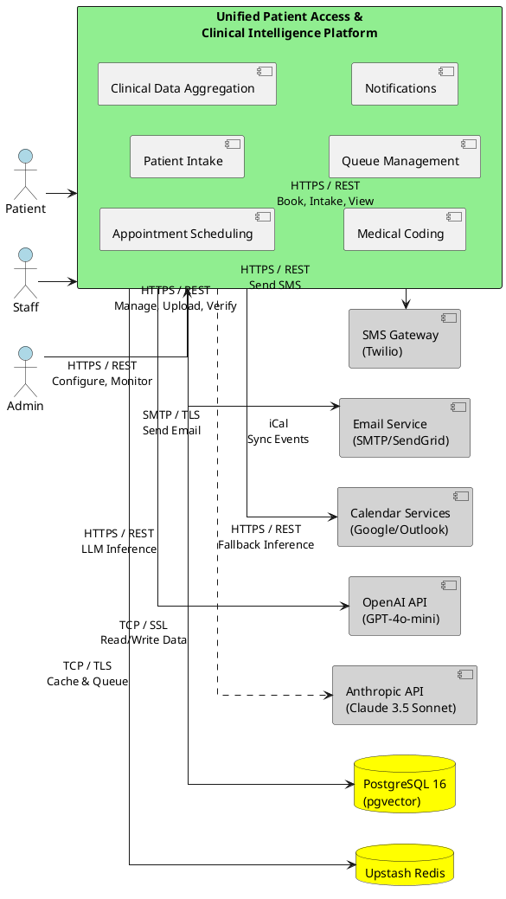
```plantuml
@startuml
!define SYSTEM rectangle
!define EXTERNAL component

skinparam linetype ortho
left to right direction

actor "Patient" as patient #LightBlue
actor "Staff" as staff #LightBlue
actor "Admin" as admin #LightBlue

SYSTEM "Unified Patient Access &\nClinical Intelligence Platform" as platform #LightGreen {
  component "Appointment Scheduling" as sched
  component "Patient Intake" as intake
  component "Clinical Data Aggregation" as clinical
  component "Medical Coding" as coding
  component "Queue Management" as queue
  component "Notifications" as notify
}

EXTERNAL "SMS Gateway\n(Twilio)" as sms #LightGray
EXTERNAL "Email Service\n(SMTP/SendGrid)" as email #LightGray
EXTERNAL "Calendar Services\n(Google/Outlook)" as calendar #LightGray
EXTERNAL "OpenAI API\n(GPT-4o-mini)" as openai #LightGray
EXTERNAL "Anthropic API\n(Claude 3.5 Sonnet)" as claude #LightGray
database "PostgreSQL 16\n(pgvector)" as db #Yellow
database "Upstash Redis" as cache #Yellow

patient --> platform : HTTPS / REST\nBook, Intake, View
staff --> platform : HTTPS / REST\nManage, Upload, Verify
admin --> platform : HTTPS / REST\nConfigure, Monitor

platform --> sms : HTTPS / REST\nSend SMS
platform --> email : SMTP / TLS\nSend Email
platform --> calendar : iCal\nSync Events
platform --> openai : HTTPS / REST\nLLM Inference
platform ..> claude : HTTPS / REST\nFallback Inference
platform --> db : TCP / SSL\nRead/Write Data
platform --> cache : TCP / TLS\nCache & Queue
@enduml
```

### Component Architecture Diagram

```mermaid
graph TB
  subgraph "Presentation Layer"
    ReactApp[React 18 SPA - MUI 5]:::core
  end

  subgraph "API Layer"
    APIGateway[ASP.NET Core Web API - Routes & Auth]:::core
    AuthMW[Auth Middleware - JWT Validation]:::core
    RateLimit[Rate Limiter - 100 req/min/user]:::core
  end

  subgraph "Service Layer"
    UserSvc[User Service - Registration & RBAC]:::core
    ApptSvc[Appointment Service - Booking & Scheduling]:::core
    IntakeSvc[Intake Service - Form & AI Intake]:::core
    NotifySvc[Notification Service - Email & SMS]:::core
    QueueSvc[Queue Service - Arrival & Wait Times]:::core
    DocSvc[Document Service - Upload & Storage]:::core
    CodingSvc[Coding Service - ICD-10 & CPT Mapping]:::core
    AuditSvc[Audit Service - Immutable Event Logging]:::core
  end

  subgraph "AI Layer"
    AIGateway[AI Gateway - Provider Routing & Polly]:::core
    RAGEngine[RAG Engine - pgvector Retrieval]:::core
    PromptMgr[Prompt Manager - Template Engine]:::core
    DocParser[Document Parser - PDF/OCR Extraction]:::core
    MedCoder[Medical Coder - Code Suggestion]:::core
    ConvIntake[Conversational Intake - NLU Agent]:::core
  end

  subgraph "Data Layer"
    EFCore[Entity Framework Core 8 - ORM]:::core
    PG[(PostgreSQL 16 + pgvector)]:::data
    Redis[(Upstash Redis - Cache & Queue)]:::data
  end

  subgraph "External Systems"
    Twilio[Twilio SMS Gateway]:::external
    SMTP[SendGrid / Gmail SMTP]:::external
    OpenAI[OpenAI GPT-4o-mini]:::external
    Claude[Anthropic Claude 3.5 Sonnet]:::external
    Calendar[Google Calendar / Outlook]:::external
  end

  ReactApp -->|HTTPS / REST| APIGateway
  APIGateway --> AuthMW
  APIGateway --> RateLimit
  APIGateway --> UserSvc
  APIGateway --> ApptSvc
  APIGateway --> IntakeSvc
  APIGateway --> QueueSvc
  APIGateway --> DocSvc
  APIGateway --> CodingSvc

  ApptSvc --> NotifySvc
  ApptSvc --> AuditSvc
  IntakeSvc --> ConvIntake
  DocSvc --> DocParser
  CodingSvc --> MedCoder

  ConvIntake --> AIGateway
  DocParser --> AIGateway
  MedCoder --> AIGateway
  AIGateway --> RAGEngine
  AIGateway --> PromptMgr

  UserSvc --> EFCore
  ApptSvc --> EFCore
  IntakeSvc --> EFCore
  QueueSvc --> EFCore
  DocSvc --> EFCore
  CodingSvc --> EFCore
  AuditSvc --> EFCore
  EFCore --> PG
  RAGEngine --> PG

  ApptSvc --> Redis
  NotifySvc --> Redis
  DocParser -.->|Async Queue| Redis

  NotifySvc --> Twilio
  NotifySvc --> SMTP
  AIGateway --> OpenAI
  AIGateway -.->|Fallback| Claude
  ApptSvc --> Calendar

  classDef core fill:#90ee90
  classDef data fill:#ffffe0
  classDef external fill:#d3d3d3
```

### Deployment Architecture Diagram

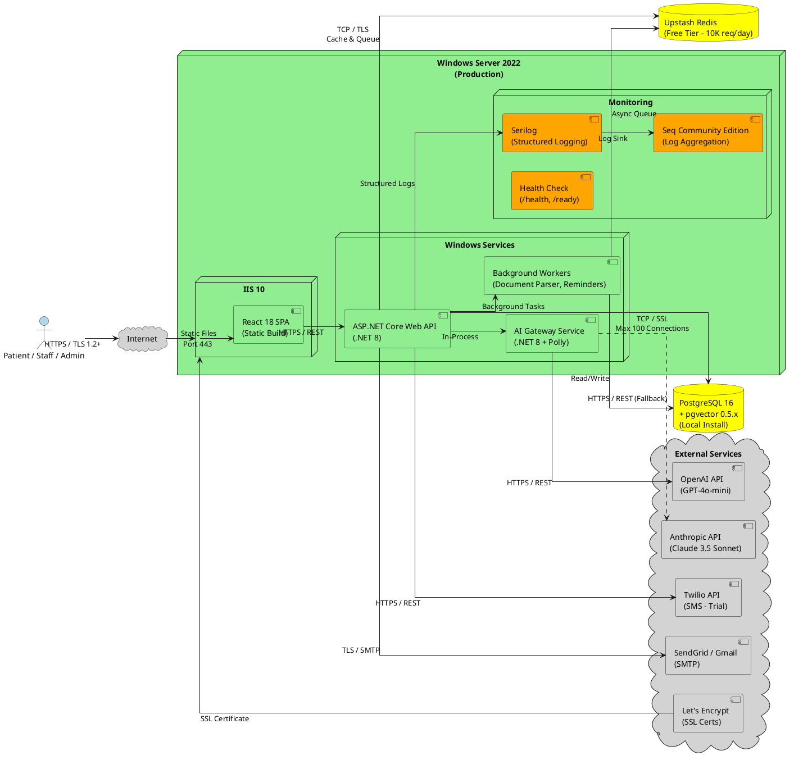
```plantuml
@startuml
!define SERVER node
!define DB database
!define CLOUD cloud

left to right direction
skinparam linetype ortho

CLOUD "Internet" as internet #LightGray {
}

SERVER "Windows Server 2022\n(Production)" as prodServer #LightGreen {
  SERVER "IIS 10" as iis {
    component "React 18 SPA\n(Static Build)" as frontend #LightGreen
  }

  SERVER "Windows Services" as winsvc {
    component "ASP.NET Core Web API\n(.NET 8)" as backend #LightGreen
    component "AI Gateway Service\n(.NET 8 + Polly)" as aigateway #LightGreen
    component "Background Workers\n(Document Parser, Reminders)" as workers #LightGreen
  }

  SERVER "Monitoring" as mon {
    component "Serilog\n(Structured Logging)" as serilog #Orange
    component "Seq Community Edition\n(Log Aggregation)" as seq #Orange
    component "Health Check\n(/health, /ready)" as health #Orange
  }
}

DB "PostgreSQL 16\n+ pgvector 0.5.x\n(Local Install)" as postgres #Yellow

DB "Upstash Redis\n(Free Tier - 10K req/day)" as redis #Yellow

CLOUD "External Services" as external #LightGray {
  component "OpenAI API\n(GPT-4o-mini)" as openai #LightGray
  component "Anthropic API\n(Claude 3.5 Sonnet)" as claude #LightGray
  component "Twilio API\n(SMS - Trial)" as twilio #LightGray
  component "SendGrid / Gmail\n(SMTP)" as smtp #LightGray
  component "Let's Encrypt\n(SSL Certs)" as letsencrypt #LightGray
}

actor "Patient / Staff / Admin" as users #LightBlue

users --> internet : HTTPS / TLS 1.2+
internet --> iis : Port 443
iis --> frontend : Static Files
frontend --> backend : HTTPS / REST
backend --> aigateway : In-Process
backend --> workers : Background Tasks
backend --> postgres : TCP / SSL\nMax 100 Connections
backend --> redis : TCP / TLS\nCache & Queue
aigateway --> openai : HTTPS / REST
aigateway ..> claude : HTTPS / REST (Fallback)
workers --> redis : Async Queue
workers --> postgres : Read/Write
backend --> serilog : Structured Logs
serilog --> seq : Log Sink
backend --> twilio : HTTPS / REST
backend --> smtp : TLS / SMTP
letsencrypt --> iis : SSL Certificate
@enduml
```

### Data Flow Diagram

```plantuml
@startuml
!define PROCESS rectangle
!define DATASTORE database
!define EXTERNAL component

left to right direction

EXTERNAL "Patient" as patient #LightBlue
EXTERNAL "Staff" as staff #LightBlue
EXTERNAL "Admin" as admin #LightBlue

PROCESS "1.0 Authentication\n& Authorization" as auth #LightGreen
PROCESS "2.0 Appointment\nScheduling" as scheduling #LightGreen
PROCESS "3.0 Patient\nIntake" as intake #LightGreen
PROCESS "4.0 Notification\nEngine" as notify #LightGreen
PROCESS "5.0 Document\nParsing Pipeline" as docparse #LightGreen
PROCESS "6.0 Clinical Data\nConsolidation" as consolidate #LightGreen
PROCESS "7.0 Medical\nCoding Engine" as coding #LightGreen
PROCESS "8.0 Queue\nManagement" as queue #LightGreen
PROCESS "9.0 System\nConfiguration" as config #LightGreen

DATASTORE "User Store" as userdb #Yellow
DATASTORE "Appointment Store" as apptdb #Yellow
DATASTORE "Patient Profile Store" as patientdb #Yellow
DATASTORE "Clinical Document Store" as docdb #Yellow
DATASTORE "Extracted Data Store" as extractdb #Yellow
DATASTORE "Medical Code Store" as codedb #Yellow
DATASTORE "Audit Log Store" as auditdb #Yellow
DATASTORE "Notification Log Store" as notifydb #Yellow
DATASTORE "Queue Store" as queuedb #Yellow
DATASTORE "Redis Cache" as cache #Yellow
DATASTORE "Vector Store (pgvector)" as vectordb #Yellow

EXTERNAL "OpenAI / Claude API" as llm #LightGray
EXTERNAL "SMS Gateway" as sms #LightGray
EXTERNAL "Email Service" as email #LightGray

patient -> auth : Credentials
staff -> auth : Credentials
admin -> auth : Credentials
auth -> userdb : Validate / Store Sessions
auth -> auditdb : Log Auth Events
auth -> cache : Store JWT Sessions

patient -> scheduling : Booking Request
scheduling -> apptdb : Create/Update Appointment
scheduling -> cache : Check/Update Slot Availability
scheduling -> notify : Trigger Confirmation
scheduling -> auditdb : Log Booking Event

patient -> intake : Intake Responses
intake -> llm : Conversational AI Prompt
intake -> vectordb : RAG Context Retrieval
intake -> patientdb : Save Intake Data
intake -> auditdb : Log Intake Access

notify -> sms : Send SMS
notify -> email : Send Email
notify -> notifydb : Log Delivery Status
notify -> cache : Read Reminder Schedule

staff -> docparse : Upload Document
docparse -> docdb : Store Document
docparse -> llm : Parse & Extract
docparse -> extractdb : Store Extracted Data
docparse -> cache : Queue Processing Job

extractdb -> consolidate : Extracted Data Points
consolidate -> patientdb : Update Patient Profile
consolidate -> llm : Conflict Detection
consolidate -> auditdb : Log Profile Changes

extractdb -> coding : Clinical Data
coding -> llm : Code Suggestion
coding -> vectordb : RAG Code Lookup
coding -> codedb : Store Approved Codes
coding -> auditdb : Log Coding Decisions

staff -> queue : Mark Arrival
queue -> queuedb : Update Queue Entry
queue -> apptdb : Read Appointments
queue -> auditdb : Log Queue Changes

admin -> config : Update Settings
config -> userdb : Manage Users
config -> apptdb : Configure Slot Templates
config -> auditdb : Log Config Changes
@enduml
```

### Logical Data Model (ERD)

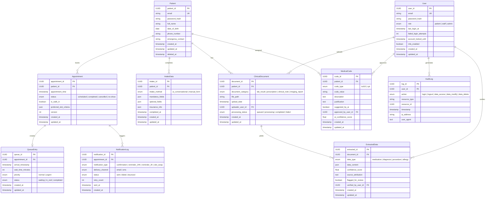
```mermaid
erDiagram
    User {
        UUID user_id PK
        string email UK
        string password_hash
        enum role "patient | staff | admin"
        timestamp last_login_at
        int failed_login_attempts
        timestamp account_locked_until
        boolean mfa_enabled
        timestamp created_at
        timestamp updated_at
    }

    Patient {
        UUID patient_id PK
        string email UK
        string password_hash
        string full_name
        date date_of_birth
        string phone_number
        string emergency_contact
        timestamp created_at
        timestamp updated_at
        timestamp deleted_at
    }

    Appointment {
        UUID appointment_id PK
        UUID patient_id FK
        timestamp appointment_time
        enum status "scheduled | completed | cancelled | no-show"
        boolean is_walk_in
        json preferred_slot_criteria
        int version
        timestamp created_at
        timestamp updated_at
    }

    IntakeData {
        UUID intake_id PK
        UUID patient_id FK
        enum intake_method "ai_conversational | manual_form"
        json mandatory_fields
        json optional_fields
        json insurance_info
        timestamp completed_at
        timestamp created_at
        timestamp updated_at
    }

    ClinicalDocument {
        UUID document_id PK
        UUID patient_id FK
        enum document_category "lab_result | prescription | clinical_note | imaging_report"
        string file_path
        timestamp upload_date
        UUID uploader_user_id FK
        enum processing_status "queued | processing | completed | failed"
        timestamp created_at
        timestamp updated_at
    }

    ExtractedData {
        UUID extracted_id PK
        UUID document_id FK
        enum data_type "medication | diagnosis | procedure | allergy"
        json data_content
        float confidence_score
        text source_attribution
        boolean flagged_for_review
        UUID verified_by_user_id FK
        timestamp created_at
        timestamp updated_at
    }

    MedicalCode {
        UUID code_id PK
        UUID patient_id FK
        enum code_type "icd10 | cpt"
        string code_value
        text description
        text justification
        boolean suggested_by_ai
        UUID approved_by_user_id FK
        float ai_confidence_score
        timestamp created_at
        timestamp updated_at
    }

    AuditLog {
        UUID log_id PK
        UUID user_id FK
        enum action "login | logout | data_access | data_modify | data_delete"
        string resource_type
        UUID resource_id
        timestamp timestamp
        string ip_address
        text user_agent
    }

    QueueEntry {
        UUID queue_id PK
        UUID appointment_id FK
        timestamp arrival_timestamp
        int wait_time_minutes
        enum priority "normal | urgent"
        enum status "waiting | in_visit | completed"
        timestamp created_at
        timestamp updated_at
    }

    NotificationLog {
        UUID notification_id PK
        UUID appointment_id FK
        enum notification_type "confirmation | reminder_24h | reminder_2h | slot_swap"
        enum delivery_channel "email | sms"
        enum status "sent | failed | bounced"
        int retry_count
        timestamp sent_at
        timestamp created_at
    }

    Patient ||--o{ Appointment : "books"
    Patient ||--o{ IntakeData : "completes"
    Patient ||--o{ ClinicalDocument : "has"
    Patient ||--o{ MedicalCode : "assigned"
    ClinicalDocument ||--o{ ExtractedData : "yields"
    Appointment ||--o{ NotificationLog : "triggers"
    Appointment ||--o| QueueEntry : "creates"
    User ||--o{ AuditLog : "generates"
    User ||--o{ ClinicalDocument : "uploads"
    User ||--o{ ExtractedData : "verifies"
    User ||--o{ MedicalCode : "approves"
```

### AI Architecture - RAG Pipeline Diagram

```mermaid
graph LR
  subgraph "Document Ingestion Pipeline"
    Upload[Staff Uploads Document]:::actor
    Validate[Validate Format & Size]:::core
    Queue[Redis Queue - Async Job]:::data
    OCR[OCR & Text Extraction]:::core
    Chunk[Chunk Text - 512 tokens, 20% overlap]:::core
    Embed[Generate Embeddings - text-embedding-3-small]:::core
    Store[Store in pgvector]:::data
  end

  subgraph "Query Runtime Flow"
    UserQuery[User Query / Clinical Input]:::actor
    QueryEmbed[Embed Query - 384 dims]:::core
    Retrieve[Top-5 Retrieval - cosine >= 0.75]:::core
    Rerank[Semantic Re-ranking]:::core
    PromptBuild[Build Prompt - Liquid Template]:::core
    LLM[LLM Inference - GPT-4o-mini]:::external
    Validate2[Validate Output - Schema + Code Library]:::core
    Response[Structured Response + Citations]:::core
  end

  subgraph "Guardrails & Validation"
    PIIRedact[PII Redaction - AIR-S01]:::core
    TokenBudget[Token Budget Enforcement - AIR-O01]:::core
    ContentFilter[Content Filtering - AIR-S05]:::core
    ConfScore[Confidence Score Assignment - AIR-Q07]:::core
    CircuitBreaker[Circuit Breaker - Polly - AIR-O04]:::core
  end

  Upload --> Validate --> Queue --> OCR --> Chunk --> Embed --> Store
  UserQuery --> QueryEmbed --> Retrieve
  Store --> Retrieve
  Retrieve --> Rerank --> PromptBuild
  PromptBuild --> PIIRedact --> TokenBudget --> LLM
  LLM --> ContentFilter --> ConfScore --> Validate2 --> Response
  LLM -.->|Failure| CircuitBreaker -.->|Fallback| Claude2[Claude 3.5 Sonnet]:::external

  classDef actor fill:#add8e6
  classDef core fill:#90ee90
  classDef data fill:#ffffe0
  classDef external fill:#d3d3d3
```

### AI Architecture - AI Sequence Diagram (Document Parsing)

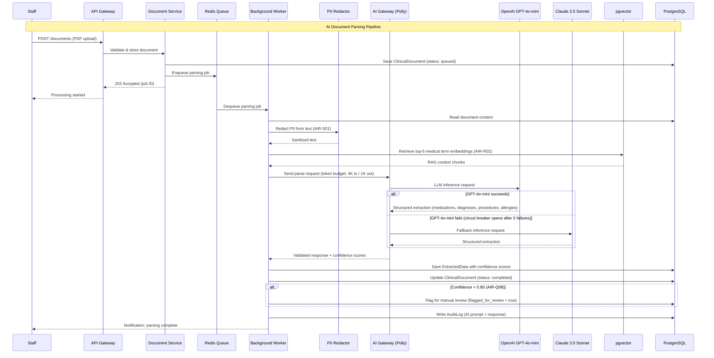
```mermaid
sequenceDiagram
    participant Staff
    participant API as API Gateway
    participant DocSvc as Document Service
    participant Queue as Redis Queue
    participant Worker as Background Worker
    participant PII as PII Redactor
    participant AIGw as AI Gateway (Polly)
    participant GPT as OpenAI GPT-4o-mini
    participant Claude as Claude 3.5 Sonnet
    participant PGV as pgvector
    participant DB as PostgreSQL

    Note over Staff,DB: AI Document Parsing Pipeline

    Staff->>API: POST /documents (PDF upload)
    API->>DocSvc: Validate & store document
    DocSvc->>DB: Save ClinicalDocument (status: queued)
    DocSvc->>Queue: Enqueue parsing job
    DocSvc-->>API: 202 Accepted (job ID)
    API-->>Staff: Processing started

    Queue->>Worker: Dequeue parsing job
    Worker->>DB: Read document content
    Worker->>PII: Redact PII from text (AIR-S01)
    PII-->>Worker: Sanitized text

    Worker->>PGV: Retrieve top-5 medical term embeddings (AIR-R02)
    PGV-->>Worker: RAG context chunks

    Worker->>AIGw: Send parse request (token budget: 4K in / 1K out)
    AIGw->>GPT: LLM inference request
    alt GPT-4o-mini succeeds
        GPT-->>AIGw: Structured extraction (medications, diagnoses, procedures, allergies)
    else GPT-4o-mini fails (circuit breaker opens after 5 failures)
        AIGw->>Claude: Fallback inference request
        Claude-->>AIGw: Structured extraction
    end

    AIGw-->>Worker: Validated response + confidence scores
    Worker->>DB: Save ExtractedData with confidence scores
    Worker->>DB: Update ClinicalDocument (status: completed)

    alt Confidence < 0.80 (AIR-Q08)
        Worker->>DB: Flag for manual review (flagged_for_review = true)
    end

    Worker->>DB: Write AuditLog (AI prompt + response)
    Worker-->>Staff: Notification: parsing complete
```

### Use Case Sequence Diagrams

> **Note**: Each sequence diagram below details the dynamic message flow for its corresponding use case. Use case diagrams remain in [spec.md](.propel/context/docs/spec.md) only.

#### UC-001: Patient Books Appointment

**Source**: [spec.md#UC-001](.propel/context/docs/spec.md#UC-001)

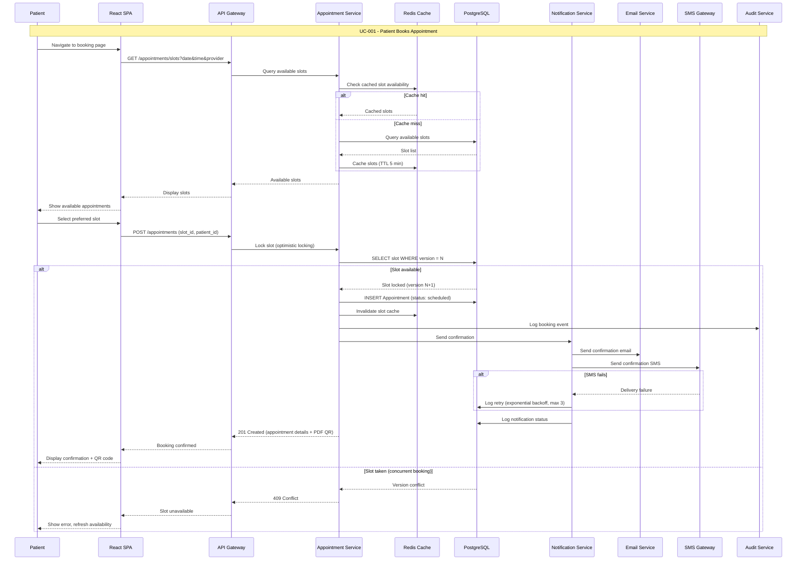
```mermaid
sequenceDiagram
    participant Patient
    participant React as React SPA
    participant API as API Gateway
    participant ApptSvc as Appointment Service
    participant Cache as Redis Cache
    participant DB as PostgreSQL
    participant NotifySvc as Notification Service
    participant Email as Email Service
    participant SMS as SMS Gateway
    participant Audit as Audit Service

    Note over Patient,Audit: UC-001 - Patient Books Appointment

    Patient->>React: Navigate to booking page
    React->>API: GET /appointments/slots?date&time&provider
    API->>ApptSvc: Query available slots
    ApptSvc->>Cache: Check cached slot availability
    alt Cache hit
        Cache-->>ApptSvc: Cached slots
    else Cache miss
        ApptSvc->>DB: Query available slots
        DB-->>ApptSvc: Slot list
        ApptSvc->>Cache: Cache slots (TTL 5 min)
    end
    ApptSvc-->>API: Available slots
    API-->>React: Display slots
    React-->>Patient: Show available appointments

    Patient->>React: Select preferred slot
    React->>API: POST /appointments (slot_id, patient_id)
    API->>ApptSvc: Lock slot (optimistic locking)
    ApptSvc->>DB: SELECT slot WHERE version = N
    alt Slot available
        DB-->>ApptSvc: Slot locked (version N+1)
        ApptSvc->>DB: INSERT Appointment (status: scheduled)
        ApptSvc->>Cache: Invalidate slot cache
        ApptSvc->>Audit: Log booking event
        ApptSvc->>NotifySvc: Send confirmation
        NotifySvc->>Email: Send confirmation email
        NotifySvc->>SMS: Send confirmation SMS
        alt SMS fails
            SMS-->>NotifySvc: Delivery failure
            NotifySvc->>DB: Log retry (exponential backoff, max 3)
        end
        NotifySvc->>DB: Log notification status
        ApptSvc-->>API: 201 Created (appointment details + PDF QR)
        API-->>React: Booking confirmed
        React-->>Patient: Display confirmation + QR code
    else Slot taken (concurrent booking)
        DB-->>ApptSvc: Version conflict
        ApptSvc-->>API: 409 Conflict
        API-->>React: Slot unavailable
        React-->>Patient: Show error, refresh availability
    end
```

#### UC-002: Patient Completes AI Intake

**Source**: [spec.md#UC-002](.propel/context/docs/spec.md#UC-002)

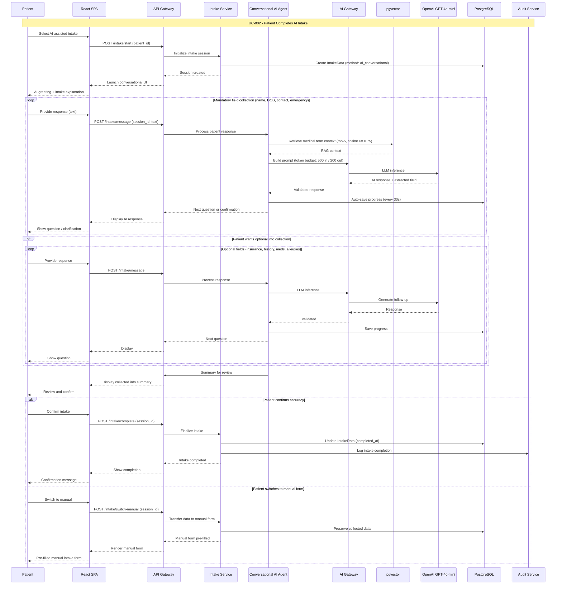
```mermaid
sequenceDiagram
    participant Patient
    participant React as React SPA
    participant API as API Gateway
    participant IntakeSvc as Intake Service
    participant ConvAI as Conversational AI Agent
    participant AIGw as AI Gateway
    participant PGV as pgvector
    participant GPT as OpenAI GPT-4o-mini
    participant DB as PostgreSQL
    participant Audit as Audit Service

    Note over Patient,Audit: UC-002 - Patient Completes AI Intake

    Patient->>React: Select AI-assisted intake
    React->>API: POST /intake/start (patient_id)
    API->>IntakeSvc: Initialize intake session
    IntakeSvc->>DB: Create IntakeData (method: ai_conversational)
    IntakeSvc-->>API: Session created
    API-->>React: Launch conversational UI
    React-->>Patient: AI greeting + intake explanation

    loop Mandatory field collection (name, DOB, contact, emergency)
        Patient->>React: Provide response (text)
        React->>API: POST /intake/message (session_id, text)
        API->>ConvAI: Process patient response
        ConvAI->>PGV: Retrieve medical term context (top-5, cosine >= 0.75)
        PGV-->>ConvAI: RAG context
        ConvAI->>AIGw: Build prompt (token budget: 500 in / 200 out)
        AIGw->>GPT: LLM inference
        GPT-->>AIGw: AI response + extracted field
        AIGw-->>ConvAI: Validated response
        ConvAI->>DB: Auto-save progress (every 30s)
        ConvAI-->>API: Next question or confirmation
        API-->>React: Display AI response
        React-->>Patient: Show question / clarification
    end

    alt Patient wants optional info collection
        loop Optional fields (insurance, history, meds, allergies)
            Patient->>React: Provide response
            React->>API: POST /intake/message
            API->>ConvAI: Process response
            ConvAI->>AIGw: LLM inference
            AIGw->>GPT: Generate follow-up
            GPT-->>AIGw: Response
            AIGw-->>ConvAI: Validated
            ConvAI->>DB: Save progress
            ConvAI-->>API: Next question
            API-->>React: Display
            React-->>Patient: Show question
        end
    end

    ConvAI->>API: Summary for review
    API-->>React: Display collected info summary
    React-->>Patient: Review and confirm

    alt Patient confirms accuracy
        Patient->>React: Confirm intake
        React->>API: POST /intake/complete (session_id)
        API->>IntakeSvc: Finalize intake
        IntakeSvc->>DB: Update IntakeData (completed_at)
        IntakeSvc->>Audit: Log intake completion
        IntakeSvc-->>API: Intake completed
        API-->>React: Show completion
        React-->>Patient: Confirmation message
    else Patient switches to manual form
        Patient->>React: Switch to manual
        React->>API: POST /intake/switch-manual (session_id)
        API->>IntakeSvc: Transfer data to manual form
        IntakeSvc->>DB: Preserve collected data
        IntakeSvc-->>API: Manual form pre-filled
        API-->>React: Render manual form
        React-->>Patient: Pre-filled manual intake form
    end
```

#### UC-003: Staff Registers Walk-in Patient

**Source**: [spec.md#UC-003](.propel/context/docs/spec.md#UC-003)

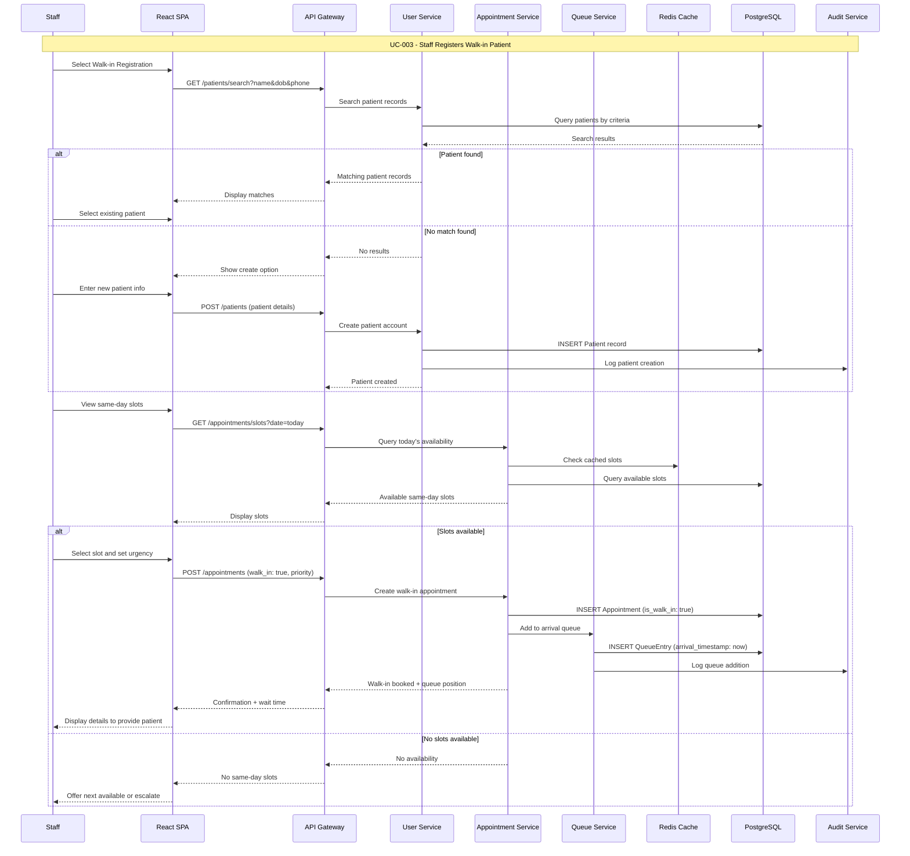
```mermaid
sequenceDiagram
    participant Staff
    participant React as React SPA
    participant API as API Gateway
    participant UserSvc as User Service
    participant ApptSvc as Appointment Service
    participant QueueSvc as Queue Service
    participant Cache as Redis Cache
    participant DB as PostgreSQL
    participant Audit as Audit Service

    Note over Staff,Audit: UC-003 - Staff Registers Walk-in Patient

    Staff->>React: Select Walk-in Registration
    React->>API: GET /patients/search?name&dob&phone
    API->>UserSvc: Search patient records
    UserSvc->>DB: Query patients by criteria
    DB-->>UserSvc: Search results

    alt Patient found
        UserSvc-->>API: Matching patient records
        API-->>React: Display matches
        Staff->>React: Select existing patient
    else No match found
        UserSvc-->>API: No results
        API-->>React: Show create option
        Staff->>React: Enter new patient info
        React->>API: POST /patients (patient details)
        API->>UserSvc: Create patient account
        UserSvc->>DB: INSERT Patient record
        UserSvc->>Audit: Log patient creation
        UserSvc-->>API: Patient created
    end

    Staff->>React: View same-day slots
    React->>API: GET /appointments/slots?date=today
    API->>ApptSvc: Query today's availability
    ApptSvc->>Cache: Check cached slots
    ApptSvc->>DB: Query available slots
    ApptSvc-->>API: Available same-day slots
    API-->>React: Display slots

    alt Slots available
        Staff->>React: Select slot and set urgency
        React->>API: POST /appointments (walk_in: true, priority)
        API->>ApptSvc: Create walk-in appointment
        ApptSvc->>DB: INSERT Appointment (is_walk_in: true)
        ApptSvc->>QueueSvc: Add to arrival queue
        QueueSvc->>DB: INSERT QueueEntry (arrival_timestamp: now)
        QueueSvc->>Audit: Log queue addition
        ApptSvc-->>API: Walk-in booked + queue position
        API-->>React: Confirmation + wait time
        React-->>Staff: Display details to provide patient
    else No slots available
        ApptSvc-->>API: No availability
        API-->>React: No same-day slots
        React-->>Staff: Offer next available or escalate
    end
```

#### UC-004: System Sends Appointment Reminders

**Source**: [spec.md#UC-004](.propel/context/docs/spec.md#UC-004)

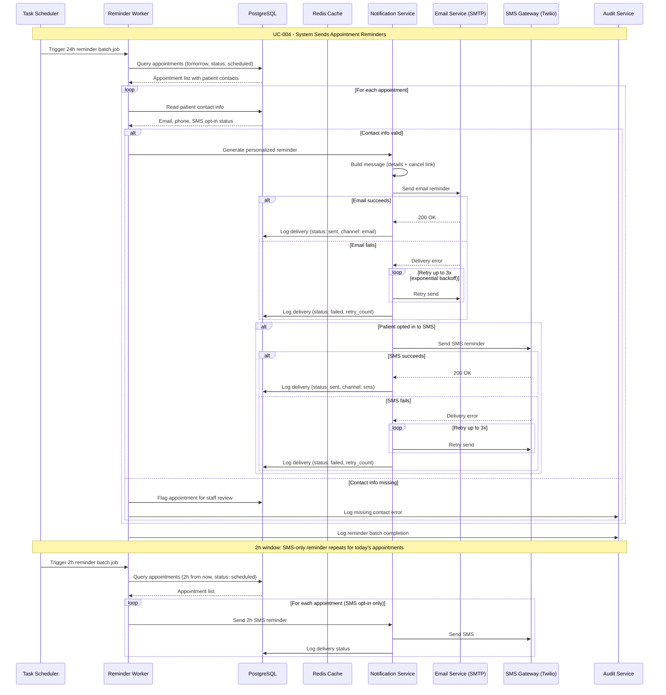
```mermaid
sequenceDiagram
    participant Scheduler as Task Scheduler
    participant Worker as Reminder Worker
    participant DB as PostgreSQL
    participant Cache as Redis Cache
    participant NotifySvc as Notification Service
    participant Email as Email Service (SMTP)
    participant SMS as SMS Gateway (Twilio)
    participant Audit as Audit Service

    Note over Scheduler,Audit: UC-004 - System Sends Appointment Reminders

    Scheduler->>Worker: Trigger 24h reminder batch job

    Worker->>DB: Query appointments (tomorrow, status: scheduled)
    DB-->>Worker: Appointment list with patient contacts

    loop For each appointment
        Worker->>DB: Read patient contact info
        DB-->>Worker: Email, phone, SMS opt-in status

        alt Contact info valid
            Worker->>NotifySvc: Generate personalized reminder
            NotifySvc->>NotifySvc: Build message (details + cancel link)

            NotifySvc->>Email: Send email reminder
            alt Email succeeds
                Email-->>NotifySvc: 200 OK
                NotifySvc->>DB: Log delivery (status: sent, channel: email)
            else Email fails
                Email-->>NotifySvc: Delivery error
                loop Retry up to 3x (exponential backoff)
                    NotifySvc->>Email: Retry send
                end
                NotifySvc->>DB: Log delivery (status: failed, retry_count)
            end

            alt Patient opted in to SMS
                NotifySvc->>SMS: Send SMS reminder
                alt SMS succeeds
                    SMS-->>NotifySvc: 200 OK
                    NotifySvc->>DB: Log delivery (status: sent, channel: sms)
                else SMS fails
                    SMS-->>NotifySvc: Delivery error
                    loop Retry up to 3x
                        NotifySvc->>SMS: Retry send
                    end
                    NotifySvc->>DB: Log delivery (status: failed, retry_count)
                end
            end
        else Contact info missing
            Worker->>DB: Flag appointment for staff review
            Worker->>Audit: Log missing contact error
        end
    end

    Worker->>Audit: Log reminder batch completion

    Note over Scheduler,Audit: 2h window: SMS-only reminder repeats for today's appointments
    Scheduler->>Worker: Trigger 2h reminder batch job
    Worker->>DB: Query appointments (2h from now, status: scheduled)
    DB-->>Worker: Appointment list
    loop For each appointment (SMS opt-in only)
        Worker->>NotifySvc: Send 2h SMS reminder
        NotifySvc->>SMS: Send SMS
        NotifySvc->>DB: Log delivery status
    end
```

#### UC-005: Staff Uploads Patient Documents

**Source**: [spec.md#UC-005](.propel/context/docs/spec.md#UC-005)

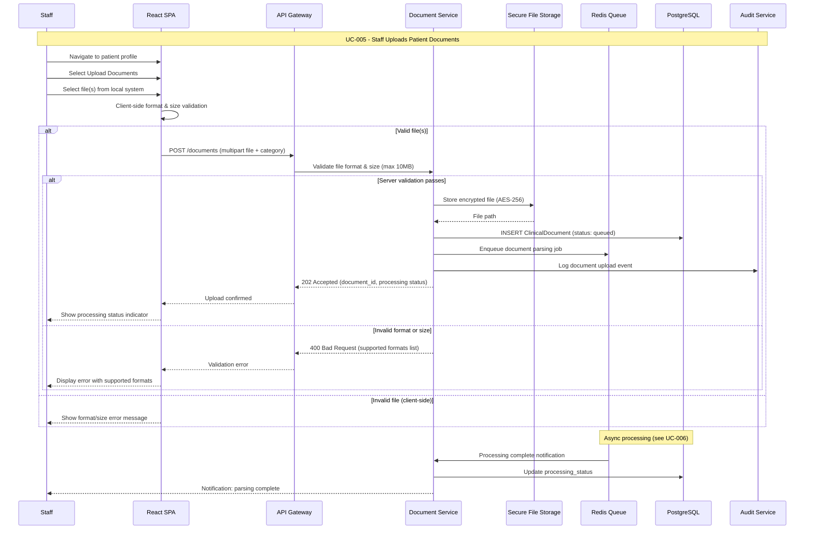
```mermaid
sequenceDiagram
    participant Staff
    participant React as React SPA
    participant API as API Gateway
    participant DocSvc as Document Service
    participant Storage as Secure File Storage
    participant Queue as Redis Queue
    participant DB as PostgreSQL
    participant Audit as Audit Service

    Note over Staff,Audit: UC-005 - Staff Uploads Patient Documents

    Staff->>React: Navigate to patient profile
    Staff->>React: Select Upload Documents
    Staff->>React: Select file(s) from local system
    React->>React: Client-side format & size validation

    alt Valid file(s)
        React->>API: POST /documents (multipart file + category)
        API->>DocSvc: Validate file format & size (max 10MB)

        alt Server validation passes
            DocSvc->>Storage: Store encrypted file (AES-256)
            Storage-->>DocSvc: File path
            DocSvc->>DB: INSERT ClinicalDocument (status: queued)
            DocSvc->>Queue: Enqueue document parsing job
            DocSvc->>Audit: Log document upload event
            DocSvc-->>API: 202 Accepted (document_id, processing status)
            API-->>React: Upload confirmed
            React-->>Staff: Show processing status indicator
        else Invalid format or size
            DocSvc-->>API: 400 Bad Request (supported formats list)
            API-->>React: Validation error
            React-->>Staff: Display error with supported formats
        end
    else Invalid file (client-side)
        React-->>Staff: Show format/size error message
    end

    Note over Queue,DB: Async processing (see UC-006)
    Queue->>DocSvc: Processing complete notification
    DocSvc->>DB: Update processing_status
    DocSvc-->>Staff: Notification: parsing complete
```

#### UC-006: System Generates 360 Patient Profile

**Source**: [spec.md#UC-006](.propel/context/docs/spec.md#UC-006)

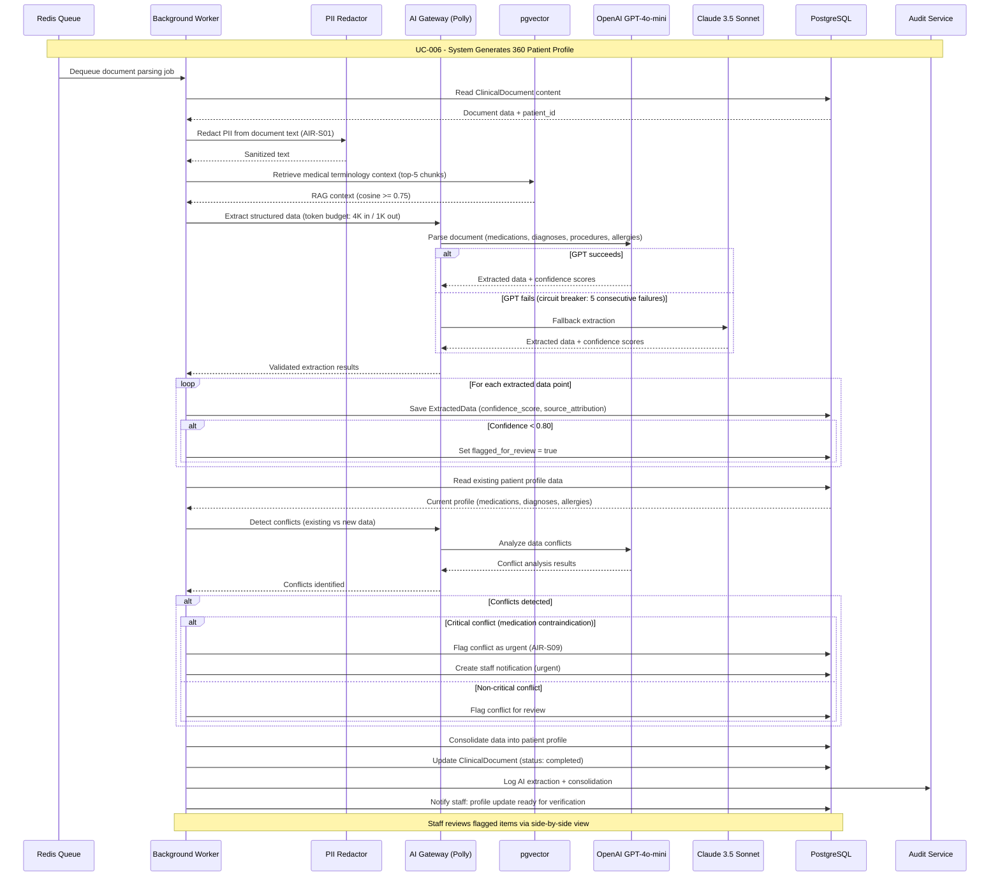
```mermaid
sequenceDiagram
    participant Queue as Redis Queue
    participant Worker as Background Worker
    participant PII as PII Redactor
    participant AIGw as AI Gateway (Polly)
    participant PGV as pgvector
    participant GPT as OpenAI GPT-4o-mini
    participant Claude as Claude 3.5 Sonnet
    participant DB as PostgreSQL
    participant Audit as Audit Service

    Note over Queue,Audit: UC-006 - System Generates 360 Patient Profile

    Queue->>Worker: Dequeue document parsing job
    Worker->>DB: Read ClinicalDocument content
    DB-->>Worker: Document data + patient_id

    Worker->>PII: Redact PII from document text (AIR-S01)
    PII-->>Worker: Sanitized text

    Worker->>PGV: Retrieve medical terminology context (top-5 chunks)
    PGV-->>Worker: RAG context (cosine >= 0.75)

    Worker->>AIGw: Extract structured data (token budget: 4K in / 1K out)
    AIGw->>GPT: Parse document (medications, diagnoses, procedures, allergies)

    alt GPT succeeds
        GPT-->>AIGw: Extracted data + confidence scores
    else GPT fails (circuit breaker: 5 consecutive failures)
        AIGw->>Claude: Fallback extraction
        Claude-->>AIGw: Extracted data + confidence scores
    end

    AIGw-->>Worker: Validated extraction results

    loop For each extracted data point
        Worker->>DB: Save ExtractedData (confidence_score, source_attribution)

        alt Confidence < 0.80
            Worker->>DB: Set flagged_for_review = true
        end
    end

    Worker->>DB: Read existing patient profile data
    DB-->>Worker: Current profile (medications, diagnoses, allergies)

    Worker->>AIGw: Detect conflicts (existing vs new data)
    AIGw->>GPT: Analyze data conflicts
    GPT-->>AIGw: Conflict analysis results
    AIGw-->>Worker: Conflicts identified

    alt Conflicts detected
        alt Critical conflict (medication contraindication)
            Worker->>DB: Flag conflict as urgent (AIR-S09)
            Worker->>DB: Create staff notification (urgent)
        else Non-critical conflict
            Worker->>DB: Flag conflict for review
        end
    end

    Worker->>DB: Consolidate data into patient profile
    Worker->>DB: Update ClinicalDocument (status: completed)
    Worker->>Audit: Log AI extraction + consolidation
    Worker->>DB: Notify staff: profile update ready for verification

    Note over Worker,DB: Staff reviews flagged items via side-by-side view
```

#### UC-007: System Performs Medical Coding

**Source**: [spec.md#UC-007](.propel/context/docs/spec.md#UC-007)

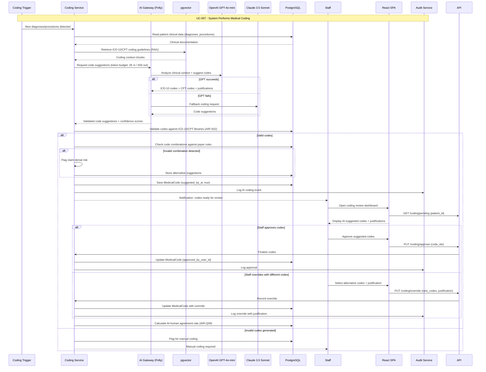
```mermaid
sequenceDiagram
    participant System as Coding Trigger
    participant CodingSvc as Coding Service
    participant AIGw as AI Gateway (Polly)
    participant PGV as pgvector
    participant GPT as OpenAI GPT-4o-mini
    participant Claude as Claude 3.5 Sonnet
    participant DB as PostgreSQL
    participant Staff
    participant React as React SPA
    participant Audit as Audit Service

    Note over System,Audit: UC-007 - System Performs Medical Coding

    System->>CodingSvc: New diagnoses/procedures detected
    CodingSvc->>DB: Read patient clinical data (diagnoses, procedures)
    DB-->>CodingSvc: Clinical documentation

    CodingSvc->>PGV: Retrieve ICD-10/CPT coding guidelines (RAG)
    PGV-->>CodingSvc: Coding context chunks

    CodingSvc->>AIGw: Request code suggestions (token budget: 2K in / 500 out)
    AIGw->>GPT: Analyze clinical context + suggest codes

    alt GPT succeeds
        GPT-->>AIGw: ICD-10 codes + CPT codes + justifications
    else GPT fails
        AIGw->>Claude: Fallback coding request
        Claude-->>AIGw: Code suggestions
    end

    AIGw-->>CodingSvc: Validated code suggestions + confidence scores

    CodingSvc->>DB: Validate codes against ICD-10/CPT libraries (AIR-S02)

    alt Valid codes
        CodingSvc->>DB: Check code combinations against payer rules
        alt Invalid combination detected
            CodingSvc->>CodingSvc: Flag claim denial risk
            CodingSvc->>DB: Store alternative suggestions
        end

        CodingSvc->>DB: Save MedicalCode (suggested_by_ai: true)
        CodingSvc->>Audit: Log AI coding event
        CodingSvc-->>Staff: Notification: codes ready for review

        Staff->>React: Open coding review dashboard
        React->>API: GET /coding/pending (patient_id)
        React-->>Staff: Display AI-suggested codes + justifications

        alt Staff approves codes
            Staff->>React: Approve suggested codes
            React->>API: PUT /coding/approve (code_ids)
            API->>CodingSvc: Finalize codes
            CodingSvc->>DB: Update MedicalCode (approved_by_user_id)
            CodingSvc->>Audit: Log approval
        else Staff overrides with different codes
            Staff->>React: Select alternative codes + justification
            React->>API: PUT /coding/override (new_codes, justification)
            API->>CodingSvc: Record override
            CodingSvc->>DB: Update MedicalCode with override
            CodingSvc->>Audit: Log override with justification
        end

        CodingSvc->>DB: Calculate AI-human agreement rate (AIR-Q09)
    else Invalid codes generated
        CodingSvc->>DB: Flag for manual coding
        CodingSvc-->>Staff: Manual coding required
    end
```

#### UC-008: Staff Manages Arrival Queue

**Source**: [spec.md#UC-008](.propel/context/docs/spec.md#UC-008)

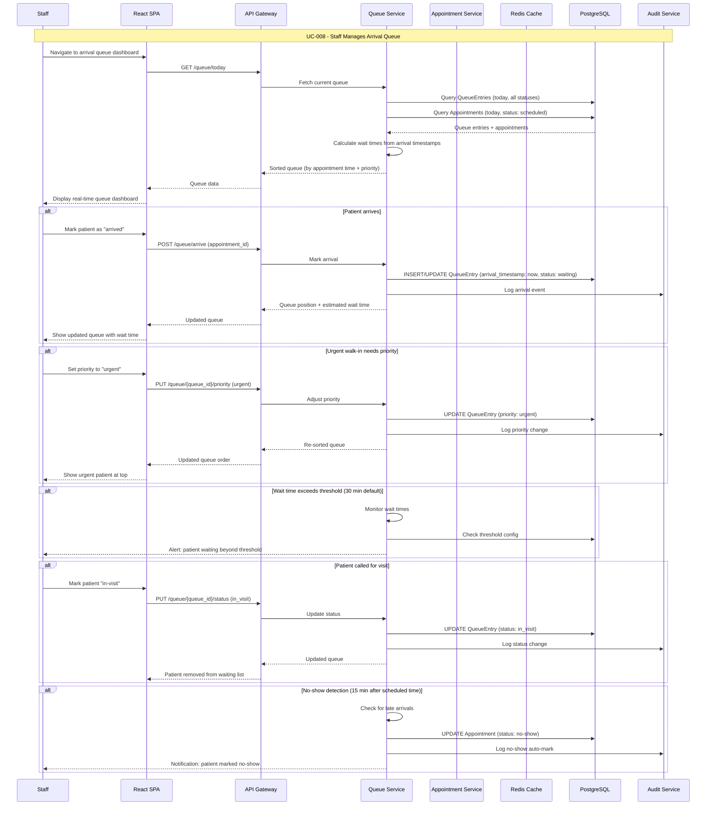
```mermaid
sequenceDiagram
    participant Staff
    participant React as React SPA
    participant API as API Gateway
    participant QueueSvc as Queue Service
    participant ApptSvc as Appointment Service
    participant Cache as Redis Cache
    participant DB as PostgreSQL
    participant Audit as Audit Service

    Note over Staff,Audit: UC-008 - Staff Manages Arrival Queue

    Staff->>React: Navigate to arrival queue dashboard
    React->>API: GET /queue/today
    API->>QueueSvc: Fetch current queue
    QueueSvc->>DB: Query QueueEntries (today, all statuses)
    QueueSvc->>DB: Query Appointments (today, status: scheduled)
    DB-->>QueueSvc: Queue entries + appointments
    QueueSvc->>QueueSvc: Calculate wait times from arrival timestamps
    QueueSvc-->>API: Sorted queue (by appointment time + priority)
    API-->>React: Queue data
    React-->>Staff: Display real-time queue dashboard

    alt Patient arrives
        Staff->>React: Mark patient as "arrived"
        React->>API: POST /queue/arrive (appointment_id)
        API->>QueueSvc: Mark arrival
        QueueSvc->>DB: INSERT/UPDATE QueueEntry (arrival_timestamp: now, status: waiting)
        QueueSvc->>Audit: Log arrival event
        QueueSvc-->>API: Queue position + estimated wait time
        API-->>React: Updated queue
        React-->>Staff: Show updated queue with wait time
    end

    alt Urgent walk-in needs priority
        Staff->>React: Set priority to "urgent"
        React->>API: PUT /queue/{queue_id}/priority (urgent)
        API->>QueueSvc: Adjust priority
        QueueSvc->>DB: UPDATE QueueEntry (priority: urgent)
        QueueSvc->>Audit: Log priority change
        QueueSvc-->>API: Re-sorted queue
        API-->>React: Updated queue order
        React-->>Staff: Show urgent patient at top
    end

    alt Wait time exceeds threshold (30 min default)
        QueueSvc->>QueueSvc: Monitor wait times
        QueueSvc->>DB: Check threshold config
        QueueSvc-->>Staff: Alert: patient waiting beyond threshold
    end

    alt Patient called for visit
        Staff->>React: Mark patient "in-visit"
        React->>API: PUT /queue/{queue_id}/status (in_visit)
        API->>QueueSvc: Update status
        QueueSvc->>DB: UPDATE QueueEntry (status: in_visit)
        QueueSvc->>Audit: Log status change
        QueueSvc-->>API: Updated queue
        API-->>React: Patient removed from waiting list
    end

    alt No-show detection (15 min after scheduled time)
        QueueSvc->>QueueSvc: Check for late arrivals
        QueueSvc->>DB: UPDATE Appointment (status: no-show)
        QueueSvc->>Audit: Log no-show auto-mark
        QueueSvc-->>Staff: Notification: patient marked no-show
    end
```

#### UC-009: Admin Configures System Settings

**Source**: [spec.md#UC-009](.propel/context/docs/spec.md#UC-009)

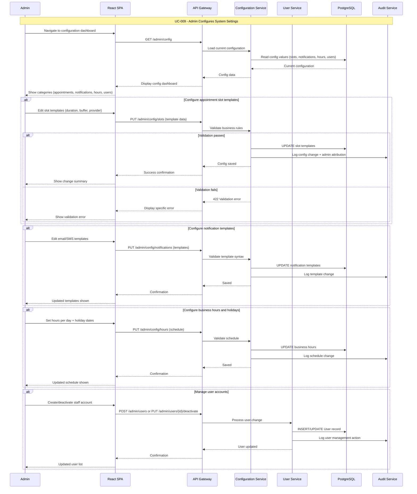
```mermaid
sequenceDiagram
    participant Admin
    participant React as React SPA
    participant API as API Gateway
    participant ConfigSvc as Configuration Service
    participant UserSvc as User Service
    participant DB as PostgreSQL
    participant Audit as Audit Service

    Note over Admin,Audit: UC-009 - Admin Configures System Settings

    Admin->>React: Navigate to configuration dashboard
    React->>API: GET /admin/config
    API->>ConfigSvc: Load current configuration
    ConfigSvc->>DB: Read config values (slots, notifications, hours, users)
    DB-->>ConfigSvc: Current configuration
    ConfigSvc-->>API: Config data
    API-->>React: Display config dashboard
    React-->>Admin: Show categories (appointments, notifications, hours, users)

    alt Configure appointment slot templates
        Admin->>React: Edit slot templates (duration, buffer, provider)
        React->>API: PUT /admin/config/slots (template data)
        API->>ConfigSvc: Validate business rules
        alt Validation passes
            ConfigSvc->>DB: UPDATE slot templates
            ConfigSvc->>Audit: Log config change + admin attribution
            ConfigSvc-->>API: Config saved
            API-->>React: Success confirmation
            React-->>Admin: Show change summary
        else Validation fails
            ConfigSvc-->>API: 422 Validation error
            API-->>React: Display specific error
            React-->>Admin: Show validation error
        end
    end

    alt Configure notification templates
        Admin->>React: Edit email/SMS templates
        React->>API: PUT /admin/config/notifications (templates)
        API->>ConfigSvc: Validate template syntax
        ConfigSvc->>DB: UPDATE notification templates
        ConfigSvc->>Audit: Log template change
        ConfigSvc-->>API: Saved
        API-->>React: Confirmation
        React-->>Admin: Updated templates shown
    end

    alt Configure business hours and holidays
        Admin->>React: Set hours per day + holiday dates
        React->>API: PUT /admin/config/hours (schedule)
        API->>ConfigSvc: Validate schedule
        ConfigSvc->>DB: UPDATE business hours
        ConfigSvc->>Audit: Log schedule change
        ConfigSvc-->>API: Saved
        API-->>React: Confirmation
        React-->>Admin: Updated schedule shown
    end

    alt Manage user accounts
        Admin->>React: Create/deactivate staff account
        React->>API: POST /admin/users or PUT /admin/users/{id}/deactivate
        API->>UserSvc: Process user change
        UserSvc->>DB: INSERT/UPDATE User record
        UserSvc->>Audit: Log user management action
        UserSvc-->>API: User updated
        API-->>React: Confirmation
        React-->>Admin: Updated user list
    end
```

#### UC-010: System Handles Preferred Slot Swap

**Source**: [spec.md#UC-010](.propel/context/docs/spec.md#UC-010)

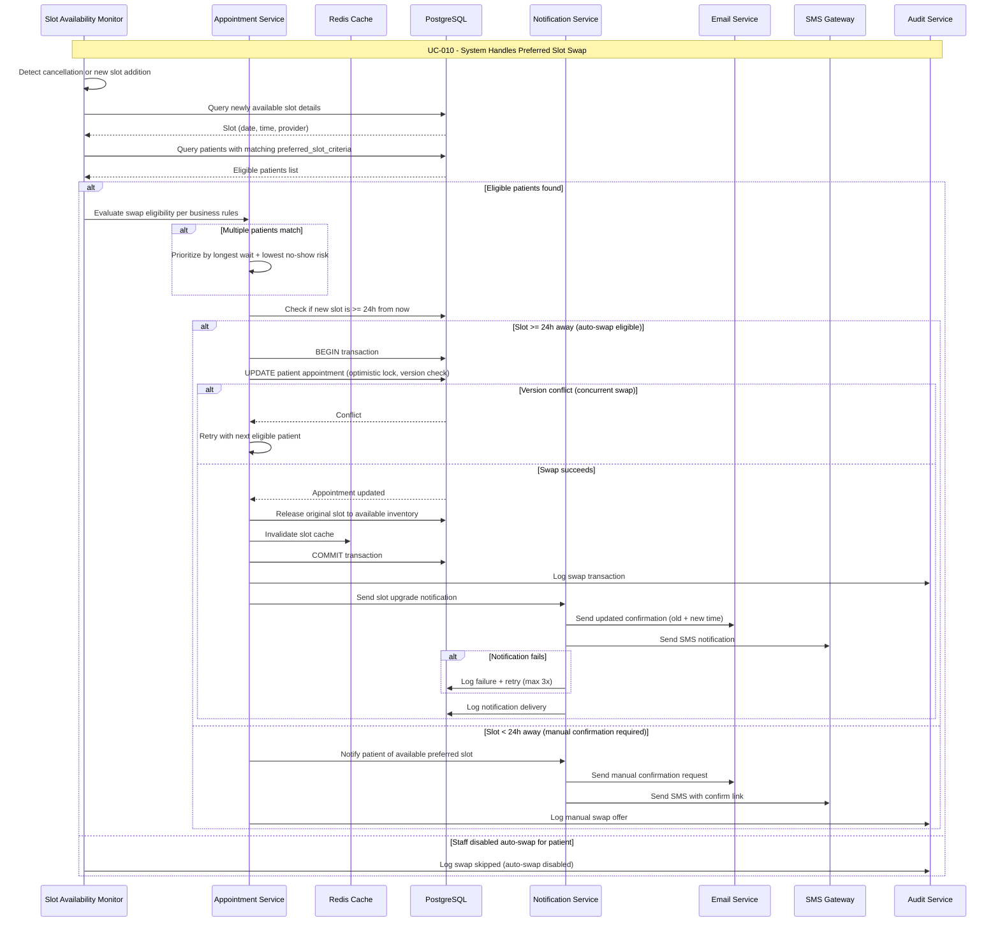
```mermaid
sequenceDiagram
    participant Monitor as Slot Availability Monitor
    participant ApptSvc as Appointment Service
    participant Cache as Redis Cache
    participant DB as PostgreSQL
    participant NotifySvc as Notification Service
    participant Email as Email Service
    participant SMS as SMS Gateway
    participant Audit as Audit Service

    Note over Monitor,Audit: UC-010 - System Handles Preferred Slot Swap

    Monitor->>Monitor: Detect cancellation or new slot addition
    Monitor->>DB: Query newly available slot details
    DB-->>Monitor: Slot (date, time, provider)

    Monitor->>DB: Query patients with matching preferred_slot_criteria
    DB-->>Monitor: Eligible patients list

    alt Eligible patients found
        Monitor->>ApptSvc: Evaluate swap eligibility per business rules

        alt Multiple patients match
            ApptSvc->>ApptSvc: Prioritize by longest wait + lowest no-show risk
        end

        ApptSvc->>DB: Check if new slot is >= 24h from now
        alt Slot >= 24h away (auto-swap eligible)
            ApptSvc->>DB: BEGIN transaction
            ApptSvc->>DB: UPDATE patient appointment (optimistic lock, version check)

            alt Version conflict (concurrent swap)
                DB-->>ApptSvc: Conflict
                ApptSvc->>ApptSvc: Retry with next eligible patient
            else Swap succeeds
                DB-->>ApptSvc: Appointment updated
                ApptSvc->>DB: Release original slot to available inventory
                ApptSvc->>Cache: Invalidate slot cache
                ApptSvc->>DB: COMMIT transaction
                ApptSvc->>Audit: Log swap transaction

                ApptSvc->>NotifySvc: Send slot upgrade notification
                NotifySvc->>Email: Send updated confirmation (old + new time)
                NotifySvc->>SMS: Send SMS notification
                alt Notification fails
                    NotifySvc->>DB: Log failure + retry (max 3x)
                end
                NotifySvc->>DB: Log notification delivery
            end

        else Slot < 24h away (manual confirmation required)
            ApptSvc->>NotifySvc: Notify patient of available preferred slot
            NotifySvc->>Email: Send manual confirmation request
            NotifySvc->>SMS: Send SMS with confirm link
            ApptSvc->>Audit: Log manual swap offer
        end

    else Staff disabled auto-swap for patient
        Monitor->>Audit: Log swap skipped (auto-swap disabled)
    end
```
