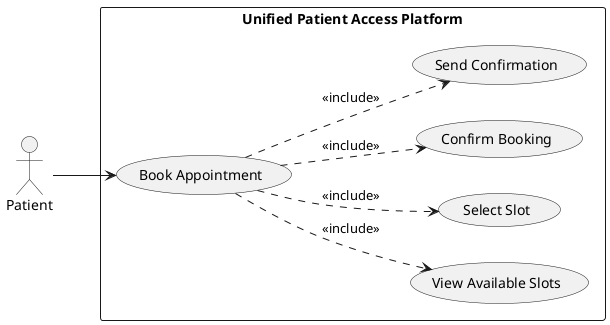
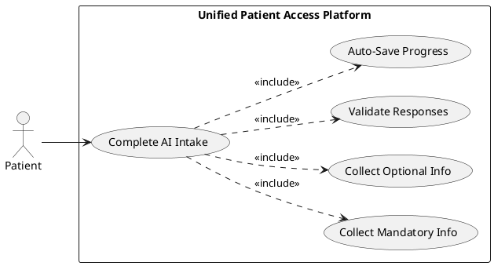
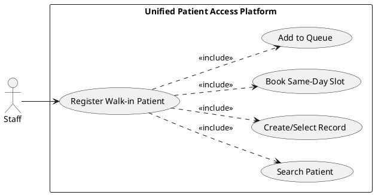
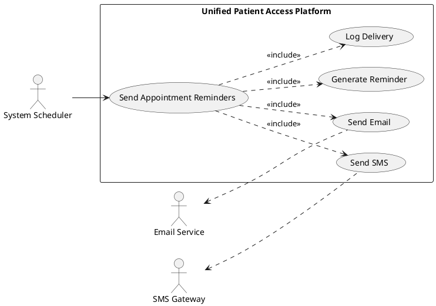
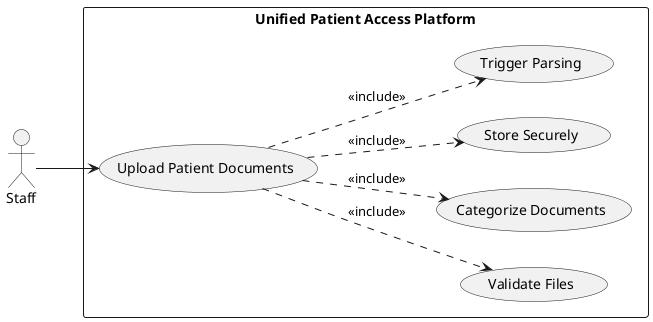
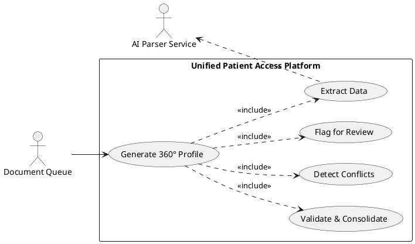
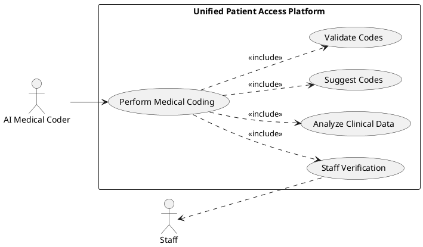
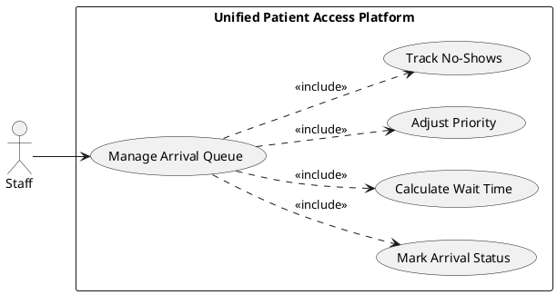
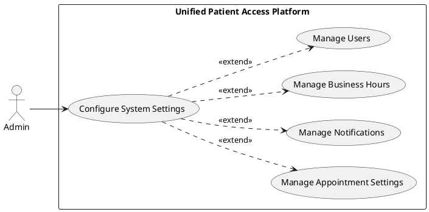
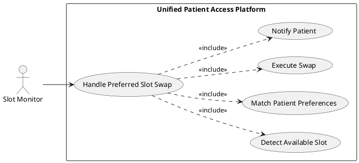

# Requirements Specification

## Feature Goal
Build a next-generation healthcare platform that unifies patient scheduling with clinical intelligence. The platform will integrate a modern, patient-centric booking system with transparent, trust-first clinical data aggregation and automated medical coding. The system will serve patients, administrative staff, and system administrators, ensuring operational efficiency, clinical accuracy, and patient safety while maintaining 100% HIPAA compliance.

## Business Justification
- **Operational Efficiency**: Reduce appointment no-show rates from 15% industry average through smart reminders, flexible intake, and dynamic slot management
- **Clinical Accuracy**: Eliminate 20+ minutes per patient spent on manual data extraction from unstructured reports through automated PDF parsing and data consolidation
- **Market Differentiation**: Address critical market gap where existing solutions are siloed—booking tools lack clinical context, and AI coding tools lack transparency
- **Patient Safety**: Prevent medication errors and treatment risks through automated conflict detection across multiple data sources
- **Revenue Protection**: Reduce claim denials through accurate ICD-10 and CPT code mapping with >98% AI-human agreement
- **Integration-Ready Architecture**: Deliver an intelligent aggregator that improves scheduling efficiency and clinical preparation without requiring direct EHR integration in Phase 1

## Feature Scope
The platform delivers end-to-end patient lifecycle management from initial appointment booking through post-visit data consolidation, targeting Phase 1 MVP functionality with planned future expansion.

### Success Criteria
- [ ] Achieve 99.9% system uptime with robust session management (15-minute timeout)
- [ ] Reduce no-show rates by 30% through intelligent reminders and dynamic slot management
- [ ] Reduce staff prep time by 50% through automated data extraction and consolidation
- [ ] Achieve >98% AI-human agreement on data accuracy and medical code mapping
- [ ] Achieve 80%+ patient adoption rate for online self-service booking
- [ ] Identify and flag 95%+ of medication/diagnosis conflicts across patient documents
- [ ] Process appointment booking requests within 2 seconds
- [ ] Complete document parsing and data extraction within 30 seconds per document
- [ ] Zero HIPAA compliance violations or security breaches
- [ ] Support 1000+ concurrent users without performance degradation

## Functional Requirements

### User Management & Authentication
- FR-001: [DETERMINISTIC] System MUST allow patients to create accounts using email and password with mandatory email verification
- FR-002: [DETERMINISTIC] System MUST enforce role-based access control (RBAC) with three distinct roles: Patient, Staff, and Admin
- FR-003: [DETERMINISTIC] System MUST implement secure session management with 15-minute inactivity timeout and automatic logout
- FR-004: [DETERMINISTIC] System MUST hash all passwords using industry-standard algorithms (bcrypt or Argon2) with minimum 10 rounds
- FR-005: [DETERMINISTIC] System MUST support password reset functionality via secure email token with 1-hour expiration
- FR-006: [DETERMINISTIC] System MUST create immutable audit logs for all authentication events (login, logout, password changes)
- FR-007: [DETERMINISTIC] System MUST prevent concurrent sessions for the same user account
- FR-008: [DETERMINISTIC] System MUST implement multi-factor authentication option for staff and admin roles
- FR-009: [DETERMINISTIC] System MUST lock accounts after 5 failed login attempts for 30 minutes
- FR-010: [DETERMINISTIC] System MUST display last login timestamp and location to users upon successful authentication

### Appointment Scheduling
- FR-011: [DETERMINISTIC] System MUST allow patients to view available appointment slots filtered by date, time, and provider
- FR-012: [DETERMINISTIC] System MUST prevent double-booking by locking slots during the booking transaction (optimistic locking)
- FR-013: [DETERMINISTIC] System MUST support appointment booking up to 90 days in advance
- FR-014: [HYBRID] System MUST calculate and display no-show risk score based on patient history and appointment characteristics
- FR-015: [DETERMINISTIC] System MUST allow patients to cancel appointments up to 24 hours before scheduled time
- FR-016: [DETERMINISTIC] System MUST automatically release cancelled slots back to available inventory within 1 minute
- FR-017: [DETERMINISTIC] System MUST support waitlist registration for fully booked time slots
- FR-018: [DETERMINISTIC] System MUST automatically offer waitlisted patients newly available slots via notification
- FR-019: [DETERMINISTIC] System MUST implement dynamic preferred slot swap by automatically moving patients to preferred slots when available
- FR-020: [DETERMINISTIC] System MUST allow staff to override automatic slot swaps and maintain manual control
- FR-021: [DETERMINISTIC] System MUST restrict walk-in appointment booking to staff role only (not available to patients)
- FR-022: [DETERMINISTIC] System MUST support same-day appointment booking for walk-in patients
- FR-023: [DETERMINISTIC] System MUST allow patients to reschedule appointments up to 24 hours before scheduled time
- FR-024: [DETERMINISTIC] System MUST maintain appointment history for each patient with status tracking (scheduled, completed, cancelled, no-show)
- FR-025: [DETERMINISTIC] System MUST sync appointments to patient's personal calendar (Google Calendar, Outlook) via iCal format

### Patient Intake
- FR-026: [AI-CANDIDATE] System MUST provide AI-assisted conversational intake that collects patient information through natural language dialogue
- FR-027: [DETERMINISTIC] System MUST offer manual form-based intake as alternative to AI conversational option
- FR-028: [DETERMINISTIC] System MUST allow patients to switch between AI and manual intake methods at any point
- FR-029: [DETERMINISTIC] System MUST collect mandatory patient information: full name, date of birth, contact information, emergency contact
- FR-030: [DETERMINISTIC] System MUST collect optional patient information: insurance details, medical history, current medications, allergies
- FR-031: [DETERMINISTIC] System MUST allow patients to edit and update intake information after initial submission
- FR-032: [DETERMINISTIC] System MUST validate patient age and restrict booking for minors (under 18) without guardian consent
- FR-033: [HYBRID] System MUST perform soft insurance pre-check against dummy validation records (no real-time payer lookup in Phase 1)
- FR-034: [DETERMINISTIC] System MUST flag insurance validation failures and notify staff for manual review
- FR-035: [DETERMINISTIC] System MUST save intake progress automatically every 30 seconds to prevent data loss

### Reminders & Notifications
- FR-036: [DETERMINISTIC] System MUST send appointment confirmation immediately after successful booking via email and SMS
- FR-037: [DETERMINISTIC] System MUST send appointment reminder 24 hours before scheduled time via email and SMS
- FR-038: [DETERMINISTIC] System MUST send second appointment reminder 2 hours before scheduled time via SMS only
- FR-039: [DETERMINISTIC] System MUST allow patients to opt-out of SMS reminders while maintaining email notifications
- FR-040: [DETERMINISTIC] System MUST generate PDF appointment confirmation with QR code for check-in
- FR-041: [DETERMINISTIC] System MUST include cancellation link in all appointment reminder communications
- FR-042: [DETERMINISTIC] System MUST notify waitlisted patients within 5 minutes when preferred slot becomes available
- FR-043: [DETERMINISTIC] System MUST send automated notification when dynamic slot swap occurs, listing old and new appointment times
- FR-044: [DETERMINISTIC] System MUST log all notification delivery attempts with status (sent, failed, bounced) in audit trail
- FR-045: [DETERMINISTIC] System MUST retry failed notification delivery up to 3 times with exponential backoff

### Clinical Data Aggregation
- FR-046: [DETERMINISTIC] System MUST allow staff to upload patient documents in PDF, DOCX, TXT, and image formats (PNG, JPG)
- FR-047: [AI-CANDIDATE] System MUST automatically parse uploaded PDF documents and extract structured clinical data
- FR-048: [AI-CANDIDATE] System MUST extract medication information including drug name, dosage, frequency, and prescribing physician
- FR-049: [AI-CANDIDATE] System MUST extract diagnosis information with associated dates and treating providers
- FR-050: [AI-CANDIDATE] System MUST extract procedure history with dates, descriptions, and performing physicians
- FR-051: [AI-CANDIDATE] System MUST extract allergy information including allergen, reaction type, and severity
- FR-052: [AI-CANDIDATE] System MUST consolidate extracted data from multiple documents into unified 360° patient profile
- FR-053: [HYBRID] System MUST identify and flag conflicts across documents (e.g., medication discrepancies, duplicate diagnoses with different dates)
- FR-054: [DETERMINISTIC] System MUST present flagged conflicts to staff for manual resolution with side-by-side comparison view
- FR-055: [DETERMINISTIC] System MUST maintain source document attribution for all extracted data points
- FR-056: [DETERMINISTIC] System MUST version all patient profile updates with timestamp and user attribution
- FR-057: [DETERMINISTIC] System MUST support document re-upload and re-processing when initial extraction quality is low
- FR-058: [DETERMINISTIC] System MUST calculate and display confidence score for each extracted data point
- FR-059: [DETERMINISTIC] System MUST flag extracted data with confidence score below 80% for manual verification
- FR-060: [DETERMINISTIC] System MUST provide document preview with highlighted extraction regions for verification

### Medical Coding
- FR-061: [AI-CANDIDATE] System MUST automatically map clinical diagnoses to ICD-10 codes with justification
- FR-062: [AI-CANDIDATE] System MUST automatically map clinical procedures to CPT codes with justification
- FR-063: [DETERMINISTIC] System MUST maintain current ICD-10 and CPT code libraries with quarterly updates
- FR-064: [HYBRID] System MUST present AI-suggested codes to staff for verification and approval before finalization
- FR-065: [DETERMINISTIC] System MUST allow staff to override AI-suggested codes with manual code selection
- FR-066: [DETERMINISTIC] System MUST log all code changes with justification and user attribution for audit trail
- FR-067: [DETERMINISTIC] System MUST calculate and display AI-human agreement rate for medical coding accuracy
- FR-068: [DETERMINISTIC] System MUST flag coding discrepancies when multiple codes apply to single diagnosis/procedure
- FR-069: [DETERMINISTIC] System MUST support multi-code assignment when clinical documentation supports multiple billable diagnoses
- FR-070: [DETERMINISTIC] System MUST validate code combinations against payer-specific rules and flag potential claim denial risks

### Queue Management
- FR-071: [DETERMINISTIC] System MUST allow staff to mark patient arrival status (arrived, no-show, cancelled)
- FR-072: [DETERMINISTIC] System MUST automatically calculate wait time from arrival mark timestamp
- FR-073: [DETERMINISTIC] System MUST display real-time arrival queue sorted by appointment time and priority
- FR-074: [DETERMINISTIC] System MUST support priority queue management for urgent walk-in patients
- FR-075: [DETERMINISTIC] System MUST allow staff to manually adjust queue order when clinical urgency requires
- FR-076: [DETERMINISTIC] System MUST automatically update no-show status 15 minutes after scheduled appointment time with no arrival
- FR-077: [DETERMINISTIC] System MUST calculate and display average wait time for current queue
- FR-078: [DETERMINISTIC] System MUST support queue filtering by provider, appointment type, and arrival status
- FR-079: [DETERMINISTIC] System MUST notify staff when patient has been waiting beyond expected threshold (configurable, default 30 minutes)
- FR-080: [DETERMINISTIC] System MUST maintain queue history for operational analytics and performance tracking

### Staff & Admin Controls
- FR-081: [DETERMINISTIC] System MUST provide staff dashboard with daily appointment schedule, arrival queue, and pending tasks
- FR-082: [DETERMINISTIC] System MUST provide admin dashboard with system metrics, user management, and configuration settings
- FR-083: [DETERMINISTIC] System MUST allow admin to configure appointment slot templates by provider and day of week
- FR-084: [DETERMINISTIC] System MUST allow admin to configure business hours and holiday schedule
- FR-085: [DETERMINISTIC] System MUST allow admin to configure notification templates for email and SMS messages
- FR-086: [DETERMINISTIC] System MUST allow admin to configure no-show risk threshold and scoring parameters
- FR-087: [DETERMINISTIC] System MUST allow admin to create and manage user accounts for staff role
- FR-088: [DETERMINISTIC] System MUST allow admin to deactivate user accounts without deleting historical data
- FR-089: [DETERMINISTIC] System MUST provide staff with patient search by name, date of birth, or phone number
- FR-090: [DETERMINISTIC] System MUST allow staff to view complete patient profile including appointments, intake data, and clinical documents

### Infrastructure & Compliance
- FR-091: [DETERMINISTIC] System MUST encrypt all data at rest using AES-256 encryption
- FR-092: [DETERMINISTIC] System MUST encrypt all data in transit using TLS 1.2 or higher
- FR-093: [DETERMINISTIC] System MUST create immutable audit logs for all data access, modifications, and deletions with user attribution
- FR-094: [DETERMINISTIC] System MUST implement automatic session timeout after 15 minutes of inactivity
- FR-095: [DETERMINISTIC] System MUST support data retention policies with configurable retention periods per data category
- FR-096: [DETERMINISTIC] System MUST deploy as native Windows Services for backend and IIS for frontend without paid cloud infrastructure
- FR-097: [DETERMINISTIC] System MUST implement Redis caching (Upstash) for frequently accessed data with 5-minute TTL
- FR-098: [DETERMINISTIC] System MUST achieve 99.9% uptime measured over rolling 30-day period
- FR-099: [DETERMINISTIC] System MUST implement health check endpoints for monitoring and alerting
- FR-100: [DETERMINISTIC] System MUST support database backup with point-in-time recovery capability

## Use Case Analysis

### Actors & System Boundary
- **Patient**: End user who books appointments, completes intake, receives reminders, and manages their health information
- **Staff**: Administrative and clinical staff who manage walk-in bookings, mark arrivals, upload documents, verify extracted data, and resolve conflicts
- **Admin**: System administrator who configures system settings, manages user accounts, maintains appointment templates, and monitors system health
- **External Systems**: 
  - SMS Gateway (Twilio-compatible): Sends SMS notifications and reminders
  - Email Service (SMTP): Sends email notifications and confirmations
  - Calendar Services (Google Calendar, Outlook): Provides calendar synchronization
  - Cache Service (Upstash Redis): Provides distributed caching

### Use Case Specifications

#### UC-001: Patient Books Appointment
- **Actor(s)**: Patient
- **Goal**: Successfully book an appointment slot with preferred date, time, and provider
- **Preconditions**: 
  - Patient has active account with verified email
  - Patient is logged into the system
  - Available appointment slots exist for desired timeframe
- **Success Scenario**:
  1. Patient navigates to appointment booking interface
  2. Patient selects desired date, time range, and provider (optional)
  3. System displays available appointment slots matching criteria
  4. Patient selects preferred appointment slot
  5. System locks selected slot with optimistic locking (1-minute hold)
  6. Patient confirms appointment details
  7. System creates appointment record and marks slot as booked
  8. System sends confirmation email and SMS to patient
  9. System generates PDF confirmation with QR code
  10. System displays booking success message with appointment details
- **Extensions/Alternatives**:
  - 3a. No available slots found for criteria
    - 3a1. System offers waitlist registration option
    - 3a2. Patient can register for waitlist or modify search criteria
  - 5a. Slot becomes unavailable during booking (concurrent booking)
    - 5a1. System releases lock and displays error message
    - 5a2. Return to step 3 with refreshed availability
  - 6a. Patient abandons booking before confirmation
    - 6a1. System releases slot lock after 1-minute timeout
    - 6a2. Slot returns to available inventory
  - 8a. SMS delivery fails
    - 8a1. System retries up to 3 times with exponential backoff
    - 8a2. System logs delivery failure in audit trail
    - 8a3. Appointment remains confirmed (email confirmation sent)
- **Postconditions**: 
  - Appointment record created with status "scheduled"
  - Selected slot no longer available to other patients
  - Patient receives confirmation via email and SMS
  - Appointment appears in patient's dashboard and calendar

##### Use Case Diagram

#### UC-002: Patient Completes AI Intake
- **Actor(s)**: Patient
- **Goal**: Complete patient intake information using AI conversational interface
- **Preconditions**: 
  - Patient has active appointment scheduled
  - Patient is logged into the system
  - AI intake service is available
- **Success Scenario**:
  1. Patient selects AI-assisted intake option from dashboard
  2. System launches conversational AI interface
  3. AI agent greets patient and explains intake process
  4. AI agent asks questions to collect mandatory information (name, DOB, contact, emergency contact)
  5. Patient provides responses via text or voice input
  6. AI agent validates responses and requests clarification if needed
  7. AI agent collects optional information (insurance, medical history, medications, allergies)
  8. System auto-saves progress every 30 seconds
  9. AI agent summarizes collected information for patient review
  10. Patient confirms accuracy of collected information
  11. System saves completed intake data to patient profile
  12. System displays completion confirmation
- **Extensions/Alternatives**:
  - 5a. Patient provides unclear or ambiguous response
    - 5a1. AI agent requests clarification with specific examples
    - 5a2. Return to step 5
  - 6a. Patient wants to switch to manual form
    - 6a1. System transfers collected data to manual form
    - 6a2. Patient continues with manual intake
  - 7a. Patient wants to skip optional information
    - 7a1. AI agent confirms patient can complete later
    - 7a2. Continue to step 9
  - 10a. Patient identifies errors in summary
    - 10a1. AI agent allows patient to correct specific fields
    - 10a2. Return to step 9 with updated information
  - 8a. Session timeout occurs
    - 8a1. System restores last auto-saved state when patient returns
    - 8a2. AI agent resumes from last completed question
- **Postconditions**: 
  - Patient intake data saved to profile
  - Intake status marked as "completed"
  - Staff notified that patient intake is ready for review

##### Use Case Diagram

#### UC-003: Staff Registers Walk-in Patient
- **Actor(s)**: Staff
- **Goal**: Register and schedule walk-in patient for same-day appointment
- **Preconditions**: 
  - Staff is logged into the system
  - Staff has appropriate role permissions for walk-in booking
- **Success Scenario**:
  1. Walk-in patient arrives at facility without prior appointment
  2. Staff selects "Walk-in Registration" from staff dashboard
  3. Staff searches for existing patient record by name, DOB, or phone
  4. System displays search results or "no match" indicator
  5. Staff creates new patient account or selects existing record
  6. Staff collects basic patient information and reason for visit
  7. Staff views available same-day appointment slots
  8. Staff selects appropriate slot based on urgency and availability
  9. System creates appointment with "walk-in" designation
  10. Staff provides patient with appointment details and expected wait time
  11. System adds patient to arrival queue automatically
- **Extensions/Alternatives**:
  - 4a. Multiple patient records match search criteria
    - 4a1. Staff reviews matching records and selects correct patient
    - 4a2. Continue to step 6
  - 7a. No same-day slots available
    - 7a1. Staff escalates to supervisor for emergency slot creation
    - 7a2. OR Staff offers next available appointment date
  - 8a. Patient condition requires urgent priority
    - 8a1. Staff marks appointment as "urgent" in queue
    - 8a2. System adjusts queue priority automatically
- **Postconditions**: 
  - Walk-in appointment created with same-day date
  - Patient added to arrival queue
  - Staff has reference number for tracking patient

##### Use Case Diagram

#### UC-004: System Sends Appointment Reminders
- **Actor(s)**: External Systems (SMS Gateway, Email Service)
- **Goal**: Automatically send timely appointment reminders to reduce no-shows
- **Preconditions**: 
  - Appointment exists with status "scheduled"
  - Patient has valid contact information (email and/or phone)
  - Current time matches reminder schedule (24 hours or 2 hours before appointment)
- **Success Scenario**:
  1. System scheduler triggers reminder job at configured interval
  2. System queries appointments scheduled for tomorrow (24-hour reminder)
  3. System retrieves patient contact information for each appointment
  4. System generates personalized reminder message with appointment details and cancellation link
  5. System sends email reminder via SMTP service
  6. System sends SMS reminder via SMS gateway (if patient opted-in)
  7. System logs delivery attempt with status (sent, failed, bounced)
  8. System repeats process for 2-hour reminder window (SMS only)
  9. System updates reminder status in appointment record
- **Extensions/Alternatives**:
  - 3a. Patient contact information missing or invalid
    - 3a1. System logs error and flags appointment for staff review
    - 3a2. Skip to next appointment
  - 5a. Email delivery fails
    - 5a1. System retries up to 3 times with exponential backoff
    - 5a2. System logs failure and continues
  - 6a. SMS delivery fails
    - 6a1. System retries up to 3 times
    - 6a2. System logs failure (email reminder still sent)
  - 6b. Patient has opted out of SMS
    - 6b1. Skip SMS delivery
    - 6b2. Email reminder still sent
- **Postconditions**: 
  - Reminder delivery logged in audit trail
  - Reminder status updated in appointment record
  - Patient receives timely notification about upcoming appointment

##### Use Case Diagram

#### UC-005: Staff Uploads Patient Documents
- **Actor(s)**: Staff
- **Goal**: Upload patient clinical documents for automated data extraction and profile consolidation
- **Preconditions**: 
  - Staff is logged into the system
  - Patient record exists in system
  - Clinical documents available in supported formats (PDF, DOCX, TXT, PNG, JPG)
- **Success Scenario**:
  1. Staff navigates to patient profile
  2. Staff selects "Upload Documents" option
  3. Staff selects one or multiple document files from local system
  4. System validates file format and size (max 10MB per file)
  5. Staff categorizes each document (lab result, prescription, clinical note, imaging report)
  6. System uploads files to secure storage
  7. System automatically triggers document parsing workflow
  8. System displays upload confirmation with processing status
  9. Staff receives notification when processing completes
- **Extensions/Alternatives**:
  - 4a. Invalid file format detected
    - 4a1. System displays error message listing supported formats
    - 4a2. Return to step 3
  - 4b. File size exceeds limit
    - 4b1. System displays error message with size limit
    - 4b2. Return to step 3
  - 7a. Document parsing fails
    - 7a1. System logs error and notifies staff
    - 7a2. Staff can retry upload or submit for manual review
  - 7b. Network error during upload
    - 7b1. System retries upload automatically
    - 7b2. If retry fails, display error and allow manual retry
- **Postconditions**: 
  - Documents uploaded to secure storage
  - Document records created with metadata (upload date, uploader, category)
  - Automated parsing workflow initiated
  - Staff notified of upload status

##### Use Case Diagram

#### UC-006: System Generates 360° Patient Profile
- **Actor(s)**: External Systems (AI Document Parser)
- **Goal**: Automatically consolidate clinical data from multiple uploaded documents into unified patient profile
- **Preconditions**: 
  - One or more patient documents uploaded and ready for processing
  - AI document parsing service is available
  - Patient profile exists in system
- **Success Scenario**:
  1. System retrieves queued document from processing queue
  2. System invokes AI parser service with document content
  3. AI service extracts structured data (medications, diagnoses, procedures, allergies)
  4. AI service assigns confidence score to each extracted data point
  5. System validates extracted data against existing patient profile
  6. System identifies potential conflicts (duplicate/contradictory data)
  7. System consolidates new data with existing profile data
  8. System maintains source attribution for each data point
  9. System generates updated 360° patient profile view
  10. System flags low-confidence extractions and conflicts for staff review
  11. System notifies staff that profile update is ready for verification
- **Extensions/Alternatives**:
  - 2a. AI parser service unavailable
    - 2a1. System retries after 5 minutes
    - 2a2. If persistent failure, alert admin and queue for manual processing
  - 3a. Document format cannot be parsed
    - 3a1. System flags document for manual data entry
    - 3a2. Notify staff of parsing failure
  - 4a. Confidence score below 80% threshold
    - 4a1. System flags data point for manual verification
    - 4a2. Continue processing remaining data
  - 6a. Critical conflict detected (e.g., allergy contradiction)
    - 6a1. System escalates conflict with urgent flag
    - 6a2. Notify staff immediately for resolution
- **Postconditions**: 
  - Patient profile updated with extracted clinical data
  - Conflicts and low-confidence items flagged for review
  - Source documents linked to profile data points
  - Staff notified of profile updates requiring verification

##### Use Case Diagram

#### UC-007: System Performs Medical Coding
- **Actor(s)**: External Systems (AI Medical Coder)
- **Goal**: Automatically map clinical diagnoses and procedures to ICD-10 and CPT codes for billing and compliance
- **Preconditions**: 
  - Patient profile contains clinical diagnoses and/or procedures
  - AI medical coding service is available
  - Current ICD-10 and CPT code libraries loaded in system
- **Success Scenario**:
  1. System identifies new diagnoses or procedures requiring coding
  2. System invokes AI medical coder with clinical documentation
  3. AI service analyzes clinical context and terminology
  4. AI service suggests ICD-10 codes for diagnoses with justification
  5. AI service suggests CPT codes for procedures with justification
  6. System validates suggested codes against current code libraries
  7. System checks code combinations against payer rules
  8. System calculates confidence score for each suggested code
  9. System presents suggested codes to staff for verification
  10. Staff reviews and approves or overrides suggested codes
  11. System records final codes with justification and user attribution
  12. System calculates AI-human agreement rate for quality tracking
- **Extensions/Alternatives**:
  - 2a. AI medical coder service unavailable
    - 2a1. System queues coding request for retry
    - 2a2. Alert staff for manual coding if urgency requires
  - 3a. Clinical documentation insufficient for accurate coding
    - 3a1. System flags case for additional documentation
    - 3a2. Notify provider to clarify diagnosis/procedure details
  - 7a. Invalid code combination detected
    - 7a1. System flags potential claim denial risk
    - 7a2. Provide alternative code suggestions
  - 10a. Staff overrides AI suggestion with different code
    - 10a1. System prompts for justification
    - 10a2. Record override details for quality improvement
  - 11a. Multiple codes apply to single diagnosis
    - 11a1. System supports multi-code assignment
    - 11a2. Rank codes by relevance and billing priority
- **Postconditions**: 
  - Diagnoses mapped to ICD-10 codes
  - Procedures mapped to CPT codes
  - Coding justifications and source documentation linked
  - AI-human agreement metrics updated
  - Codes ready for billing and claims submission (future phase)

##### Use Case Diagram

#### UC-008: Staff Manages Arrival Queue
- **Actor(s)**: Staff
- **Goal**: Efficiently manage patient arrival queue to optimize wait times and provider workflow
- **Preconditions**: 
  - Staff is logged into the system
  - Multiple patients scheduled for current day
  - Some patients have arrived and checked in
- **Success Scenario**:
  1. Staff navigates to arrival queue dashboard
  2. System displays real-time queue with appointment time, arrival status, and wait time
  3. Patient arrives and checks in at reception
  4. Staff marks patient as "arrived" in system
  5. System calculates wait time from arrival timestamp
  6. System adds patient to active queue sorted by appointment time and priority
  7. Staff views patient details and reason for visit
  8. Staff adjusts queue order if clinical urgency requires priority
  9. System displays updated queue to all staff members
  10. Staff calls patient when provider ready
  11. Staff marks patient as "in-visit" to remove from queue
- **Extensions/Alternatives**:
  - 3a. Patient arrives late (after scheduled time)
    - 3a1. System flags late arrival
    - 3a2. Staff assesses impact on schedule and adjusts queue
  - 4a. Patient does not arrive within 15 minutes of scheduled time
    - 4a1. System automatically marks as "no-show"
    - 4a2. Staff receives notification to contact patient
  - 8a. Walk-in urgent patient requires immediate attention
    - 8a1. Staff marks patient as "urgent" priority
    - 8a2. System moves patient to top of queue
    - 8a3. System notifies other staff of queue change
  - 10a. Patient wait time exceeds threshold (30 minutes default)
    - 10a1. System alerts staff with notification
    - 10a2. Staff communicates delay to patient
- **Postconditions**: 
  - Accurate real-time arrival queue maintained
  - Patient wait times tracked for operational analytics
  - Queue history recorded for performance reporting
  - All queue changes logged with user attribution

##### Use Case Diagram

#### UC-009: Admin Configures System Settings
- **Actor(s)**: Admin
- **Goal**: Configure system-wide settings to customize platform behavior for organizational needs
- **Preconditions**: 
  - Admin is logged into the system
  - Admin has appropriate role permissions for system configuration
- **Success Scenario**:
  1. Admin navigates to system configuration dashboard
  2. Admin selects configuration category (appointment settings, notification templates, business hours, user management)
  3. System displays current configuration values
  4. Admin modifies configuration parameters
  5. System validates configuration changes for business rule compliance
  6. Admin saves configuration changes
  7. System applies changes immediately or schedules for next business day
  8. System creates audit log entry with configuration changes and admin attribution
  9. System displays confirmation message with change summary
  10. Affected users receive notification of configuration changes (if applicable)
- **Extensions/Alternatives**:
  - 4a. Admin configures appointment slot templates
    - 4a1. Admin defines slot duration, buffer time, and provider assignments
    - 4a2. Admin sets recurring schedule by day of week
  - 4b. Admin configures notification templates
    - 4b1. Admin edits email/SMS message content with variable placeholders
    - 4b2. System validates template syntax
  - 4c. Admin configures business hours and holidays
    - 4c1. Admin sets operating hours for each day of week
    - 4c2. Admin defines holiday dates when facility is closed
  - 5a. Invalid configuration detected
    - 5a1. System displays specific validation error
    - 5a2. Return to step 4 to correct
  - 6a. Configuration change requires system restart
    - 6a1. System prompts admin to schedule maintenance window
    - 6a2. System queues change for next scheduled restart
- **Postconditions**: 
  - System configuration updated with new values
  - Configuration changes logged in audit trail
  - Affected system behavior modified according to new settings
  - Users notified of relevant changes

##### Use Case Diagram

#### UC-010: System Handles Preferred Slot Swap
- **Actor(s)**: External Systems (Slot Availability Monitor)
- **Goal**: Automatically move patients to preferred appointment slots when they become available
- **Preconditions**: 
  - Patient has scheduled appointment
  - Patient has registered preferred slot criteria (date, time, provider)
  - Slot availability monitor is running
- **Success Scenario**:
  1. System monitors appointment cancellations and new slot additions
  2. Cancelled slot becomes available matching patient's preferred criteria
  3. System identifies patients with current appointments and matching preferences
  4. System evaluates swap eligibility based on business rules
  5. System performs automatic slot swap transaction
  6. System updates appointment record with new date/time
  7. System releases original slot back to available inventory
  8. System sends notification to patient about slot upgrade
  9. System logs swap transaction in audit trail
  10. Patient receives updated appointment confirmation via email and SMS
- **Extensions/Alternatives**:
  - 3a. Multiple patients match preferred criteria
    - 3a1. System prioritizes by longest wait time and no-show risk score
    - 3a2. Swap highest priority patient first
  - 4a. Preferred slot is too soon (less than 24 hours)
    - 4a1. System skips automatic swap to allow patient time to prepare
    - 4a2. Notify patient of available preferred slot for manual confirmation
  - 5a. Concurrent swap transaction creates conflict
    - 5a1. System uses optimistic locking to prevent double-booking
    - 5a2. Retry swap for next available preferred slot
  - 6a. Staff has disabled automatic swaps for specific patient
    - 6a1. System skips swap and maintains original appointment
    - 6a2. Log reason for swap prevention
  - 8a. Notification delivery fails
    - 8a1. System retries notification up to 3 times
    - 8a2. Log delivery failure but maintain swapped appointment
- **Postconditions**: 
  - Patient moved to preferred appointment slot
  - Original slot returned to available inventory
  - Patient notified of updated appointment
  - Swap transaction logged for audit and analytics

##### Use Case Diagram

## Risks & Mitigations

### Risk 1: AI Service Reliability - Medical Coding and Data Extraction Accuracy
**Impact**: High - Inaccurate medical coding could lead to claim denials and revenue loss; incorrect data extraction could compromise patient safety  
**Probability**: Medium - AI services may have variable accuracy across different document formats and medical terminology  
**Mitigation**: 
- Implement hybrid approach requiring staff verification for all AI-suggested codes and extracted data
- Set confidence score thresholds (80%+) below which manual review is mandatory
- Maintain human-in-the-loop workflow with side-by-side comparison views
- Track AI-human agreement rates and continuously improve model accuracy
- Provide fallback to full manual coding when AI service unavailable

### Risk 2: HIPAA Compliance Violations - Data Breach or Unauthorized Access
**Impact**: Critical - Legal penalties, reputation damage, loss of patient trust  
**Probability**: Low-Medium - Healthcare systems are high-value targets for cyber attacks  
**Mitigation**: 
- Implement comprehensive security controls: AES-256 encryption at rest, TLS 1.2+ in transit
- Enforce strict RBAC with principle of least privilege
- Create immutable audit logs for all data access and modifications
- Implement 15-minute session timeout and automatic logout
- Conduct regular security audits and penetration testing
- Provide security awareness training for all staff

### Risk 3: System Performance Degradation - High Concurrent User Load
**Impact**: Medium - Poor user experience, potential appointment booking failures, staff productivity loss  
**Probability**: Medium - System may experience peak loads during high-traffic periods  
**Mitigation**: 
- Implement Redis caching for frequently accessed data (appointment slots, patient profiles)
- Use optimistic locking for appointment booking to handle concurrent requests
- Set performance budgets: 2-second max for booking, 30-second max for document parsing
- Implement rate limiting and request throttling for API endpoints
- Conduct load testing to identify bottlenecks before production deployment
- Design for horizontal scalability for future cloud migration

### Risk 4: No-Show Rate Reduction Target Not Achieved - Patient Behavior Unchanged
**Impact**: Medium - Business case ROI not realized, operational efficiency gains limited  
**Probability**: Medium - Patient behavior change depends on multiple factors beyond system capabilities  
**Mitigation**: 
- Implement multi-channel reminder strategy (email + SMS at 24h and 2h before appointment)
- Use dynamic preferred slot swap to increase patient satisfaction and commitment
- Calculate and display no-show risk scores to enable targeted staff outreach
- Provide easy cancellation links in all communications to free up slots for waitlisted patients
- Track no-show metrics by patient segment and refine reminder strategy based on data
- Consider future gamification or incentive programs to improve attendance

### Risk 5: Document Parsing Failures - Unsupported Formats or Poor Quality Scans
**Impact**: Medium - Manual data entry burden remains, efficiency gains not realized  
**Probability**: High - Healthcare documents vary widely in format, quality, and structure  
**Mitigation**: 
- Support multiple input formats (PDF, DOCX, TXT, PNG, JPG) to maximize compatibility
- Implement document quality validation with file size limits and format checks
- Provide clear error messages with supported format guidance when upload fails
- Enable document re-upload and re-processing workflow when initial parsing quality low
- Maintain manual data entry option as fallback for unsupported formats
- Display confidence scores for extracted data to flag low-quality extractions for review

## Constraints & Assumptions

### Constraint 1: No Direct EHR Integration in Phase 1
**Rationale**: Direct integration with Electronic Health Record systems requires vendor-specific APIs, extensive testing, and potential FHIR/HL7 compliance that exceeds Phase 1 scope and timeline  
**Impact**: System operates as standalone aggregator; clinical data must be manually uploaded rather than automatically synchronized  
**Future Consideration**: Plan for EHR integration in Phase 2 using FHIR-compliant APIs

### Constraint 2: Free/Open-Source Infrastructure Only - No Paid Cloud Services
**Rationale**: Project budget constraints require use of free-tier cloud offerings and open-source technologies  
**Impact**: 
- Backend deployment limited to native Windows Services and IIS (no Azure App Service, AWS Lambda)
- Caching limited to Upstash Redis free tier with capacity restrictions
- SMS gateway limited to free Twilio trial credits
- Frontend hosting on Netlify/Vercel free tiers with bandwidth limits  
**Future Consideration**: Plan cloud migration path when budget allows for production-grade hosting

### Constraint 3: Dummy Insurance Validation - No Real-Time Payer Lookup
**Rationale**: Real-time insurance eligibility verification requires paid payer API subscriptions and complex integration  
**Impact**: System performs soft validation against dummy records only; manual verification still required by staff  
**Future Consideration**: Integrate with Availity, Change Healthcare, or other clearinghouses in Phase 2

### Constraint 4: PostgreSQL Database Only - No Multi-Database Support
**Rationale**: Standardize on single database platform to reduce complexity and maintenance burden  
**Impact**: All data (patient records, appointments, clinical data, audit logs) stored in PostgreSQL; no separate graph DB or document store  
**Future Consideration**: Evaluate specialized databases (e.g., MongoDB for document storage) if performance issues arise

### Constraint 5: English Language Only - No Internationalization
**Rationale**: Initial target market is English-speaking healthcare facilities in United States  
**Impact**: All UI text, notifications, and AI conversational intake in English only; no multi-language support  
**Future Consideration**: Add i18n framework and Spanish language support in future release

### Assumption 1: Patients Have Email and Mobile Phone Access
**Rationale**: Multi-channel reminder strategy depends on patient email and SMS availability  
**Impact**: Patients without email or mobile phone cannot receive automated reminders  
**Validation**: Track patient contact information completeness during onboarding; provide alternative phone-call reminder option if needed

### Assumption 2: Staff Will Verify All AI-Generated Codes and Data
**Rationale**: Hybrid AI-human workflow assumes staff have time and expertise to review AI output  
**Impact**: If staff skip verification due to time pressure, accuracy guarantees may not hold  
**Validation**: Monitor AI-human agreement rates and staff verification completion rates; provide training as needed

### Assumption 3: Uploaded Clinical Documents Are Legitimate and Accurate
**Rationale**: System assumes uploaded PDFs and documents contain accurate clinical information  
**Impact**: System does not validate authenticity of uploaded documents or detect fraudulent records  
**Validation**: Implement document source attribution and chain of custody tracking; consider digital signature verification in future

### Assumption 4: Network Connectivity Is Reliable for SMS/Email Delivery
**Rationale**: Notification delivery depends on third-party SMS gateway and SMTP service availability  
**Impact**: Network outages or service disruptions could prevent reminder delivery  
**Validation**: Implement retry logic with exponential backoff; monitor delivery success rates and alert on failures

### Assumption 5: Business Hours and Provider Availability Are Relatively Stable
**Rationale**: Appointment slot templates assume consistent weekly schedule without frequent changes  
**Impact**: If provider schedules change frequently, slot templates may become outdated  
**Validation**: Provide admin interface to easily update slot templates; implement schedule override capability for exceptions
